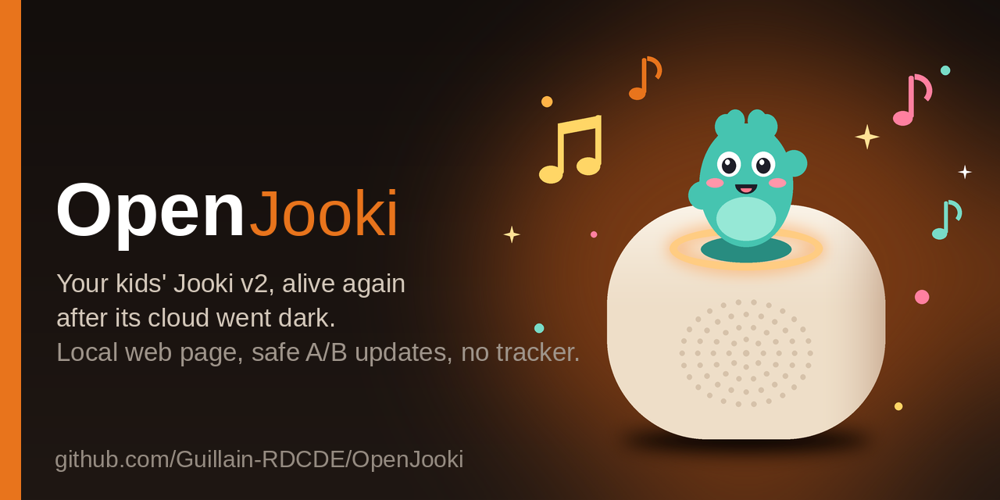
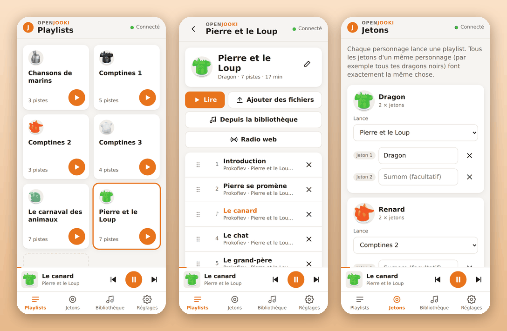

# OpenJooki

**Your child's Jooki v2 keeps working, even though the Jooki servers are gone.**
Your music stays, your tokens keep working, and you get a simple page to manage
everything from your phone. Nothing leaves your home, and it **cannot break your
Jooki**.

> Independent community project, not affiliated with Muuselabs / Jooki.

---

# For parents: the simple version

No technical knowledge needed. Follow the steps in order.

### What you need

- Your **Jooki v2**, switched on and **plugged in**, on your home Wi‑Fi.
  (Not sure it's a v2? No risk: a v1 is recognised and refused, nothing happens.)
- A **phone** on the **same Wi‑Fi**.
- Your Jooki's **address**, four numbers like `192.168.1.19`. To find it, open
  your internet box's page or app, look at the list of connected devices, and
  find the one whose name starts with **jooki**.

### 1. Install or update OpenJooki (from your phone)

1. On your phone, open **https://guillain-rdcde.github.io/OpenJooki/**
2. Type your Jooki's address. The page remembers it for next time.
3. Tap **Install OpenJooki** (first time) or **Update**, confirm, then **wait**.

The Jooki does everything by itself and restarts on its own: about
**10–15 minutes** the first time, **up to 10 minutes** for an update. Nothing
happens on screen during that time, **that's normal**. Don't unplug it.

Already installed OpenJooki before? Tap **Update**: it brings the new page below.
From version 1.2.0 on, you can also update **from the Jooki's own page**: when a
new version exists, a message tells you so, and one tap on **Update now** does it.

### 2. Manage your music (from your phone)



On your phone, open **`http://` + your Jooki's address**, for example
`http://192.168.1.19`. You can:

- create playlists and **add songs straight from your phone**;
- choose **which character** starts which playlist (every token of the same
  character does the same thing: all the dragons, all the whales…);
- play, pause, change the volume, turn the Jooki off;
- see your OpenJooki version and **update it in one tap** when a new one is out.

**At bedtime** (since 1.3.0):

- **audiobooks resume where your child fell asleep**, chapter and minute, even
  after the Jooki turned itself off (mark the playlist as *Audiobook*);
- a **sleep timer** in the player (10 to 60 minutes, or *end of chapter*): the
  volume goes down gently, then the Jooki pauses;
- a **night mode** (Settings → Bedtime, 20:00–07:00 by default): every token
  starts the timer on its own, the volume is limited whatever the knob says, and
  the lights are dimmed.

The page also works on a weak Wi‑Fi (uploads retry on their own), shows how
good the Wi‑Fi is, and answers at **`http://<its name>.local/`** (the name is
shown in Settings), so you don't need the address any more.

The page is part of OpenJooki: nothing else to install.

### Questions

- **Will I lose my music or my tokens?** No. They live on a separate part of the
  Jooki that updates never touch.
- **Something went wrong / it doesn't restart?** Unplug it, plug it back in: it
  automatically goes back to the previous version.
- **Can someone outside my home see my Jooki?** No. Everything stays on your home
  network: no account, no cloud, no tracking.

---

# For the technically curious

Everything is open and readable.

## Why it's safe

Every change goes through the Jooki's own A/B update system:

- it writes to the **spare** partition, never the one currently running;
- the transfer is **verified bit‑for‑bit** (sha256);
- switching over **arms an automatic rollback**: if the new version doesn't
  start, the Jooki returns to the previous one at the next power‑up.

The bootloader and the factory partition are **never** touched. Only a Jooki
**v2** (`ml-j2000`) is accepted; a v1 is refused before anything is written.

## Phone installer: how it works

The installer page sends the install command to the Jooki, which downloads the
release from this repository, verifies it, writes it to the spare partition and
reboots. A tiny throwaway `ok` tab may flash up when the command is sent. It's
harmless, and the page closes it where the browser allows: the page is served
over HTTPS and the Jooki answers over plain HTTP, so the browser won't let the
command fire completely invisibly, but the Jooki receives it either way. Details:
[docs/16-phone-install.md](docs/16-phone-install.md).

## The same install from a computer

Everything a parent does from the phone can also be done from a computer.

### Install a firmware

With Python 3 on a machine on the same Wi‑Fi:

```sh
python3 tools/openjooki/installer_web.py
```

Your browser opens: drag the firmware onto the page, click **Install safely**.
The same safe A/B install, with a progress bar. See
[docs/14-cross-platform-installer.md](docs/14-cross-platform-installer.md).

### The web page and the application fixes (`patch webui`)

Included in the firmware since 1.1.0. On a Jooki you manage from a computer, it
can also be applied on its own:

```sh
python3 tools/openjooki/jooki.py --host <jooki-ip> patch webui            # install (A/B, rollback armed)
python3 tools/openjooki/jooki.py --host <jooki-ip> patch webui --dry-run  # build and check only
python3 tools/openjooki/jooki.py --host <jooki-ip> patch switch <2|3>     # go back
```

A new local page (no framework, no external request) replaces the 2018 app, and
the Jooki's own program (`player.lib`, Lua) is fixed in place: token links by
character, protected "Unused tracks", no file loss on failed uploads, no crash on
bad messages, safer database writes… Full list, protocol and test bench:
[docs/18-web-ui.md](docs/18-web-ui.md). Firmware images get the same changes with
`scripts/add-webui-to-image.py`.

## Under the hood: the Jooki, taken apart

To replace its brain, we first read all of it. The Jooki v2 is a set of small
closed programs (Wi‑Fi/NFC chip, buttons, lights, sound, web server) wired over
a local MQTT bus, plus one application program that holds all the behaviour:
what a token does, how playback works, what the lights mean, when it turns
itself off. That program is what OpenJooki has been patching, and what 2.0
replaces.


- **[docs/22 — the current core, function by function](docs/22-core-inventory.md)**:
  every module, every message on the bus (about 90), every timer, file, shell
  script and system event of the original application, with measurements
  taken on a live Jooki — and the ten things it does that a good program
  should not (three shell processes and eight flash writes per second while
  idle, for a start).
- **[docs/21 — OpenJooki 2.0, the core designed to last](docs/21-architecture-2.0.md)**:
  our own open‑source application for the Jooki: one event loop, pure
  handlers, all I/O behind adapters, a versioned contract with the page,
  atomic data, a Wi‑Fi that manages itself, security by default — with eight
  one‑idea diagrams, numeric budgets, a test strategy where the current bench
  is the oracle, and a six‑phase migration that never leaves a Jooki without a
  way back.
- **[docs/adr — decision records](docs/adr/README.md)**: each structural choice,
  the alternatives, the consequences.
- The rest of the reverse engineering: [the MQTT bus](docs/08-system-mqtt-map.md),
  [firmware internals](docs/09-internals-deep-dive.md) (ESP32 protocol, boot,
  partitions), [the security audit](docs/12-firmware-audit.md),
  [the Wi‑Fi chip's habits and the Bluetooth rescue](docs/20-network-health.md).

## The command-line tool

`tools/openjooki/jooki.py`: a small Python CLI (standard library only) to
discover, back up, re‑add music and apply firmware patches over your local
network. See [tools/openjooki/README.md](tools/openjooki/README.md).

## Documentation

- [docs/15-ota-github.md](docs/15-ota-github.md) — how a Jooki fetches a release from this repo and installs it by itself
- [docs/04-architecture.md](docs/04-architecture.md) — hardware & data model
- [docs/06-root-access.md](docs/06-root-access.md) — getting root over SSH
- [docs/08-system-mqtt-map.md](docs/08-system-mqtt-map.md) — the internal MQTT bus
- [docs/09-internals-deep-dive.md](docs/09-internals-deep-dive.md) — firmware internals
- [docs/10-patch-tool-design.md](docs/10-patch-tool-design.md) — the anti‑brick A/B patch design
- [docs/12-firmware-audit.md](docs/12-firmware-audit.md) — security audit & fixes
- [docs/18-web-ui.md](docs/18-web-ui.md) — the new web page and the application fixes
- [docs/19-bedtime.md](docs/19-bedtime.md) — audiobook resume, sleep timer, night mode
- [docs/20-network-health.md](docs/20-network-health.md) — uploads that survive, logs kept home, `.local` name, Wi‑Fi rescue
- [docs/21-architecture-2.0.md](docs/21-architecture-2.0.md) — the 2.0 core design · [docs/22-core-inventory.md](docs/22-core-inventory.md) — the current core, function by function · [docs/adr/](docs/adr/README.md)
- …and the rest of `docs/` (community survey, maintenance plan, content API, roadmap).

## Layout

```
tools/openjooki/          the tool, the web installer, the auditable fixes
tools/openjooki/webui/    the local web page served by the Jooki
tools/openjooki/tests/    off-device test bench (real application + browser)
tools/openjooki/device/   scripts that run on the Jooki (self-install, OTA)
docs/                     technical analysis, architecture, runbooks, audit
docs/adr/                 architecture decision records (2.0)
docs/img/arch/            functional diagrams (generated by tools/diagrams/)
scripts/                  utilities (prepare a release)
```

## Contact

Guillain d'Erceville — guillain@poulpe.us

## License

MIT. Use at your own risk; the tool is designed to be safe, but always keep a
backup.
