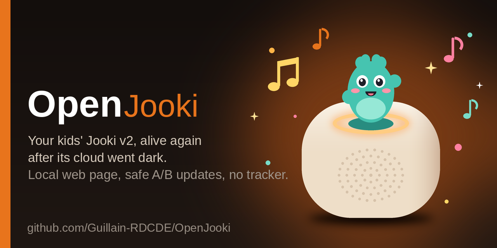
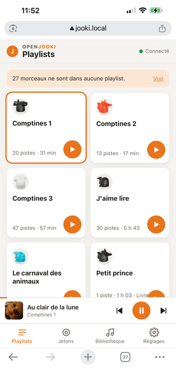
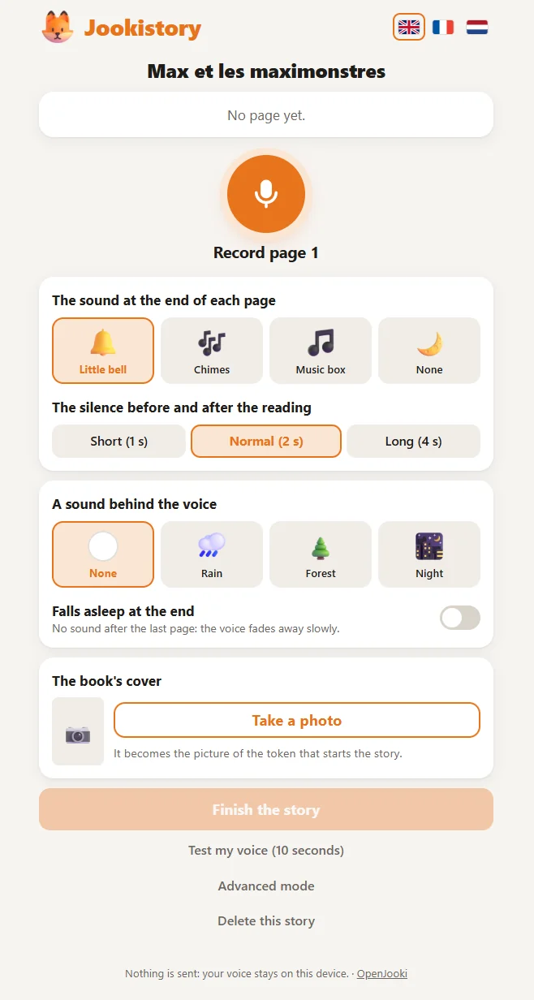
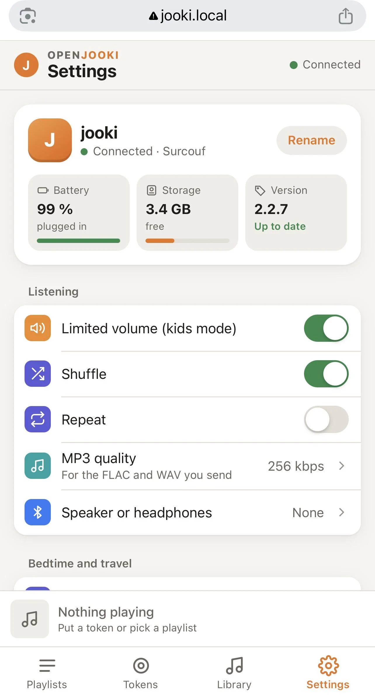

# OpenJooki

**Your child's Jooki 2 keeps working, and gets better, even though the Jooki company is gone.**
Free, made by a parent, not affiliated with Muuselabs / Jooki.

  
  &nbsp;
  
  &nbsp;
  

The Jooki's page on a phone · Jookistory, a story read by you · Settings

## What do you need?

| Your situation | Go here |
|---|---|
| My Jooki works, but the app doesn't any more | **[Install OpenJooki](guide/install.md)** · 15 min, from your phone |
| I have OpenJooki: playlists, tokens, bedtime, Bluetooth speaker… | **[Use it](guide/use.md)** |
| I want to read a story myself | **[Jookistory: a story read by you](guide/use.md#a-story-read-by-you)** |
| Grandma reads from far away, and the book gets its own token | **[From far away](guide/use.md#a-story-read-from-far-away)** · **[Labels for the books](guide/use.md#labels-for-the-books)** |
| I use Spotify on my phone | **[Spotify on the Jooki](guide/use.md#spotify)** |
| A new version is out | **[Update it](guide/update.md)** · from the Jooki's page |
| My Jooki doesn't start any more | **[A new SD card](https://guillain-rdcde.github.io/OpenJooki/sdcard.html#new)** · 10 min with a computer |
| No more room for music | **[A bigger SD card](https://guillain-rdcde.github.io/OpenJooki/sdcard.html#bigger)** · with a computer |
| It lost its Wi-Fi (moved house, new box, new password) | **[Give it its Wi-Fi back](https://guillain-rdcde.github.io/OpenJooki/wifi.html)** · Android phone or computer |
| I want the original Jooki back | **[The original Jooki card](https://guillain-rdcde.github.io/OpenJooki/sdcard.html#original)** |
| We're going away: holiday, car, no Wi-Fi | **[Away from home](guide/travel.md)** |
| The lights, the battery, the charger | **[What they mean](guide/lights-and-battery.md)** |
| Anything else | **[Questions](guide/questions.md)** |

**New in 2.4.1:** a story sent from Jookistory after a long reading no longer vanishes, and Jookistory says what happened.
2.4.0: put the token on the Jooki and it starts the story, with the book's cover as its picture; labels to print; a story is one file to send; rain, forest or night behind the voice.
2.3.2: the story studio is called Jookistory; a story is never shuffled, even added by hand; shuffle in the Spotify app no longer shuffles the tokens.
2.3.1: *Record a story* is now a card right next to *New playlist*.
2.3.0: read a story yourself, page by page, and the Jooki plays it back: *Record a story* on the playlists page.
2.2.7: the update screen no longer looks stuck: it finds the Jooki again by itself.
2.2.6: shuffle really shuffles; the characters have Dutch names; an audiobook says at once where it will resume.
2.2.5: the pages inside Settings no longer blink.
2.2.3: FLAC albums go onto the Jooki as MP3, three times lighter; on a computer, drop an album folder and it becomes a playlist.
2.2.2: the page opens by the Jooki's name every time (`http://` + its name + `.local`).
2.2.1: the page in dark or light, your choice; and a *Christmas tree* button, just for fun.
2.2.0: each flat token can start its own story; 659 ready-made pictures for flat tokens and NFC tags; a shorter Settings page.
[All the changes](CHANGELOG.md)

---

**How it works** (for the curious and the technical): [docs/](docs/README.md) ·
Guillain d'Erceville, guillain@poulpe.us · MIT license. Built to be safe, but use it at
your own risk.
