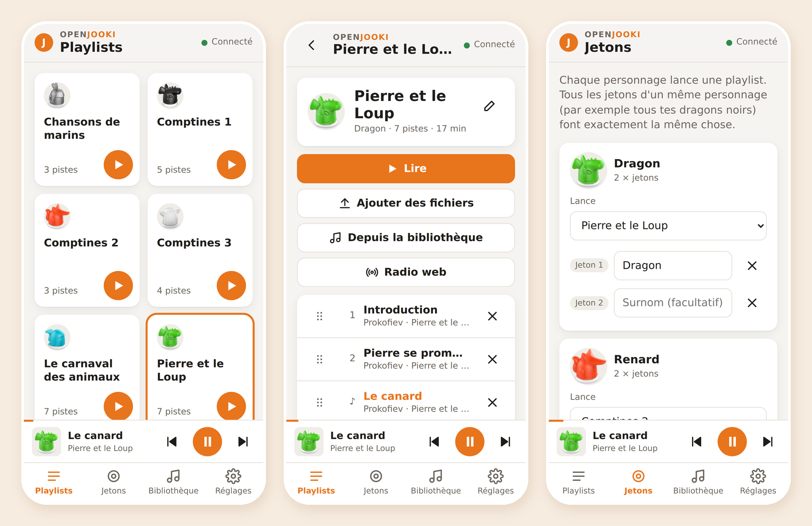
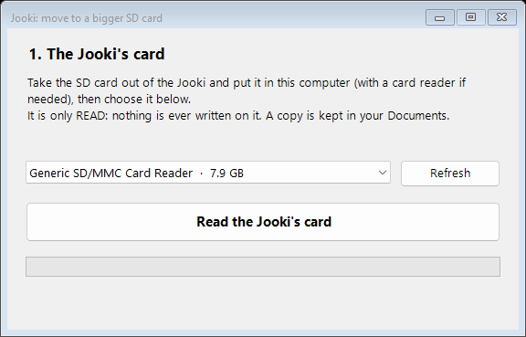

# OpenJooki

**Your child's Jooki keeps working, and gets better, even though the Jooki company and its servers are gone.**

Free, made by a parent, not affiliated with Muuselabs / Jooki. For the **Jooki 2**.

## What you get

- **A simple page on your phone**, served by the Jooki itself: create playlists, add
  songs straight from your phone, choose which character plays which playlist, play,
  pause, change the volume. It replaces the official app, which stopped working.
- **A Jooki that starts faster**, with a brand new program inside (OpenJooki 2).
- **A name of your choice**: open `http://jooki.local` (or any name you like) instead of
  remembering an address.
- **An icon on your phone's home screen**, to open the Jooki's page in one tap.
- **Bedtime made easy**: audiobooks pick up where your child fell asleep, a sleep timer
  fades the music out gently, and a night mode keeps the volume low and the lights dim.
- **The old bugs fixed**: every token of the same character does the same thing, uploads
  survive a weak Wi‑Fi, a failed upload leaves no mess, and odd messages no longer
  crash the Jooki.
- **Your own tags**: an amiibo or an NFC sticker can start a playlist too, like a
  Jooki token (taking it off does not pause).
- **Nothing leaves your home**: no account, no cloud, no tracking.
- **Updates in one tap**, from the Jooki's own page.

## Install it (about 15 minutes, from your phone)

You need a **Jooki 2**, switched on and **plugged in**, and a **phone on the same Wi‑Fi**.

1. **Find your Jooki's address.** Open your internet box's app or page, look at the
   connected devices, and find the one whose name starts with **jooki**. Its address
   looks like `192.168.1.19`.
2. On your phone, open **https://guillain-rdcde.github.io/OpenJooki/**, type that
   address and tap **Install OpenJooki**.
3. **Wait.** The Jooki installs everything by itself and restarts on its own. Nothing
   happens on screen meanwhile: that's normal. Don't unplug it.

Not sure it's a Jooki 2? No risk: any other model is recognised and nothing happens.

**Already have OpenJooki?** Open the Jooki's page: a message offers the new version,
one tap on **Update now** does it.

## Use it

On your phone, type **`http://`** followed by your Jooki's address, for example
`http://192.168.1.19`. Don't forget the `http://`: without it, some phones search the
web instead.

- **Give it a name**: Settings → Name → **Rename**, for example `jooki`. From then on,
  open `http://jooki.local`, whatever the address.
- **Add it to your home screen**: on iPhone, Share → *Add to Home Screen*; on Android,
  menu ⋮ → *Add to Home screen*.

## More room for music: a bigger SD card

The Jooki keeps its music on a small SD card inside it (about 5 GB for music). With a
Windows computer or a Mac you can move everything to a **bigger card**, in a few clicks,
and the tool never writes to the Jooki's own card.

**[→ The bigger SD card tool](https://guillain-rdcde.github.io/OpenJooki/sdcard.html)**

## Questions

- **Will I lose my music or my tokens?** No. They live on a part of the Jooki that
  updates never touch.
- **What if something goes wrong?** Unplug the Jooki and plug it back in: it goes back
  to the previous version by itself.
- **Can anyone outside my home see my Jooki?** No. No account, no cloud, no tracking.
- **And the Jooki 1?** It's on the way, but it's a much more closed box: it takes more work.
- **What do the lights mean? It gets warm when charging, the battery no longer lasts?**
  See [the lights, the battery and the USB-C port](docs/24-hardware-and-lights.md).

## How it works

The plumbing (why it can't break a Jooki, how the Jooki was taken apart, the new program,
the tools) is explained in **[docs/](docs/README.md)**.

## Contact · License

Guillain d'Erceville — guillain@poulpe.us

MIT license. Built to be safe, but use it at your own risk.
