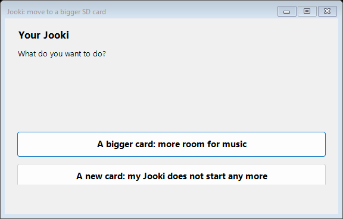
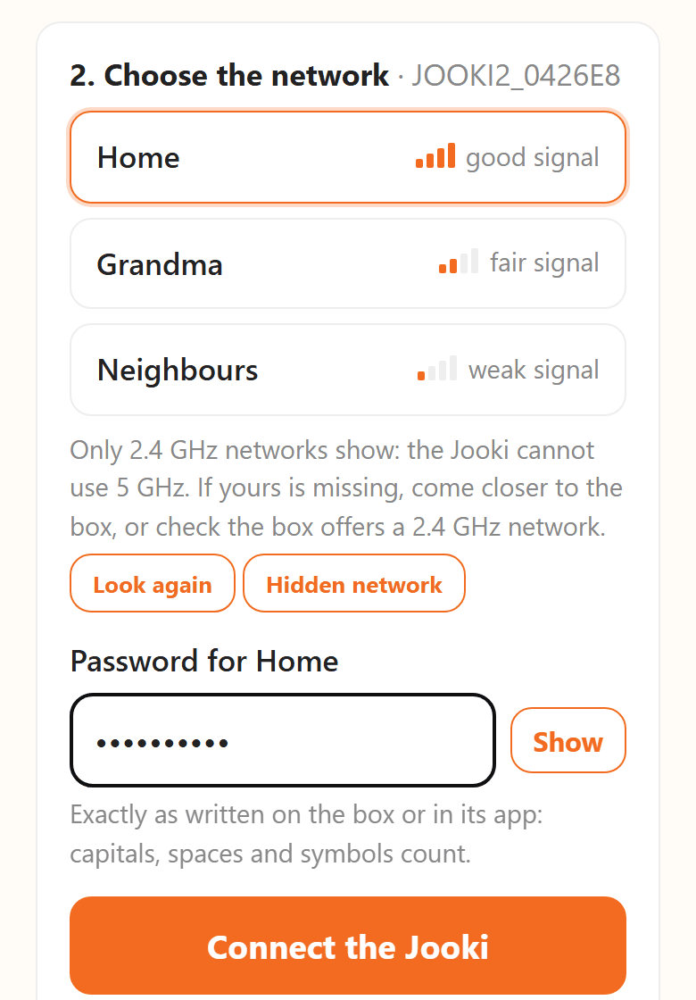

# OpenJooki

**Your child's Jooki keeps working, and gets better, even though the Jooki company and its servers are gone.**

Free, made by a parent, not affiliated with Muuselabs / Jooki. For the **Jooki 2**.

## Start here

- **Your Jooki works, the app does not** → [install OpenJooki from your phone](#install-it-about-15-minutes-from-your-phone), 15 minutes, nothing to open.
- **Your Jooki no longer starts** (side dots dark, a reset does nothing) → its memory card is dead. [Make it a new card](https://guillain-rdcde.github.io/OpenJooki/sdcard.html) with a Windows computer, a Mac or a Linux computer: ten minutes, and it starts again.
- **Out of room for music** → [move it to a bigger card](https://guillain-rdcde.github.io/OpenJooki/sdcard.html), same tool.
- **Your Jooki lost its Wi-Fi** (moved house, new box, new password; its lights stay red) →
  [give it the new network](https://guillain-rdcde.github.io/OpenJooki/wifi.html) over Bluetooth, two
  minutes with an **Android phone or a computer**. Not from an iPhone: Apple keeps Bluetooth away
  from web pages ([why](#questions)).
- **A question about the lights, the battery, the charger** → [the lights, the battery and the USB-C port](docs/24-hardware-and-lights.md).

## New in 2.0.5

- **Bluetooth speakers and headphones.** Jooki had built them into the Jooki 2 and never
  put the button in the app. Settings → *Bluetooth speaker or headphones*.
- **Airplane mode from the page**, always for a set time: no radio next to the bed.
- **Wi-Fi without the app**: a Jooki that lost its network gets it back over Bluetooth.
- **A dead Jooki starts again**: a complete new SD card, made in ten minutes.

Already on OpenJooki: open the Jooki's page, tap **Update now**. All the details: [CHANGELOG](CHANGELOG.md).

## What you get

- **A simple page on your phone**, served by the Jooki itself: create playlists, add
  songs straight from your phone, choose which character plays which playlist, play,
  pause, change the volume. It replaces the official app, which stopped working.
- **A Jooki that starts faster**, with a brand new program inside (OpenJooki 2).
- **A name of your choice**: open `http://jooki.local` (or any name you like) instead of
  remembering an address.
- **An icon on your phone's home screen**, to open the Jooki's page in one tap.
- **Bedtime made easy**: audiobooks pick up where your child fell asleep, a sleep timer
  fades the music out gently, and a night mode keeps the volume low and the lights dim.
- **The old bugs fixed**: every token of the same character does the same thing, uploads
  survive a weak Wi‑Fi, a failed upload leaves no mess, and odd messages no longer
  crash the Jooki.
- **Your own tags**: an amiibo or an NFC sticker can start a playlist too, like a
  Jooki token (taking it off does not pause).
- **Bluetooth speakers and headphones**: the sound goes to your speaker, and comes back
  to the Jooki when the speaker is switched off.
- **Nothing leaves your home**: no account, no cloud, no tracking.
- **Updates in one tap**, from the Jooki's own page.

## Install it (about 15 minutes, from your phone)

You need a **Jooki 2**, switched on and **plugged in**, and a **phone on the same Wi‑Fi**.

1. **Find your Jooki's address.** Open your internet box's app or page, look at the
   connected devices, and find the one whose name starts with **jooki**. Its address
   looks like `192.168.1.19`.
2. On your phone, open **https://guillain-rdcde.github.io/OpenJooki/**, type that
   address and tap **Install OpenJooki**.
3. **Wait.** The Jooki installs everything by itself and restarts on its own. Nothing
   happens on screen meanwhile: that's normal. Don't unplug it.

Not sure it's a Jooki 2? No risk: any other model is recognised and nothing happens.

**Already have OpenJooki?** Open the Jooki's page: a message offers the new version,
one tap on **Update now** does it.

## Use it

On your phone, type **`http://`** followed by your Jooki's address, for example
`http://192.168.1.19`. Don't forget the `http://`: without it, some phones search the
web instead.

- **Give it a name**: Settings → Name → **Rename**, for example `jooki`. From then on,
  open `http://jooki.local`, whatever the address.
- **Add it to your home screen**: on iPhone, Share → *Add to Home Screen*; on Android,
  menu ⋮ → *Add to Home screen*.
- **Airplane mode**: Settings → *Airplane mode* switches the Wi-Fi and Bluetooth off for
  the time you choose (a few hours, until the morning, or until the next start). The
  Jooki brings them back by itself; tokens and music work the whole time.
- **A Bluetooth speaker or headphones**: put them in pairing mode, then Settings →
  *Bluetooth speaker or headphones* → **Search** → **Connect**. Next time, just switch
  the speaker on: the Jooki reconnects by itself.

## The SD card: more room, or a Jooki brought back to life

The Jooki keeps everything on a small SD card inside it (about 5 GB for music). With a
Windows computer, a Mac or a Linux computer, one tool does three things:

- **a bigger card**: move everything to a bigger card in a few clicks; the tool never
  writes to the Jooki's own card;
- **a new card from scratch**: for a Jooki that no longer starts because its card died
  (dark side dots, reset does nothing). The tool downloads a complete, clean card image
  and writes it on a blank card; the Jooki starts again, with an empty library. What is
  on that card: [docs/25-new-sd-card.md](docs/25-new-sd-card.md);
- **the original Jooki**: a card with the Jooki exactly as it was sold, without OpenJooki,
  for whoever wants it back ([docs/27-original-card.md](docs/27-original-card.md)).

**[→ The SD card tool](https://guillain-rdcde.github.io/OpenJooki/sdcard.html)**

## Moved house, new box? Give the Jooki its Wi-Fi back

The Jooki only ever learnt its Wi-Fi from the old app. When the network changes, it
stays red and silent. Its chip also listens over **Bluetooth**, and one page speaks to
it: it shows the networks the Jooki sees, you pick yours, type the password, and ten
seconds later the Jooki is back. From **Chrome on an Android phone or a computer**
(Windows, Mac or Linux), nothing to install. Not from an iPhone: [why](#questions).

**[→ Connect the Jooki to Wi-Fi](https://guillain-rdcde.github.io/OpenJooki/wifi.html)**

## Questions

- **My Jooki does not start at all, whatever I do.** Nine times out of ten its memory
  card is dead. [A new card](https://guillain-rdcde.github.io/OpenJooki/sdcard.html)
  brings it back; the music has to be added again.
- **Will I lose my music or my tokens?** No. They live on a part of the Jooki that
  updates never touch.
- **What if something goes wrong?** Unplug the Jooki and plug it back in: it goes back
  to the previous version by itself.
- **Can I go back to the original Jooki?** Yes: the [SD card tool](https://guillain-rdcde.github.io/OpenJooki/sdcard.html)
  makes a card with the Jooki exactly as it was sold, without OpenJooki. Keep the Jooki's own
  card: it is your way back. But the official app and Jooki's servers are gone, so the original
  program can no longer be set up from a phone.
- **Can anyone outside my home see my Jooki?** No. No account, no cloud, no tracking.
- **Why can't I reconnect the Wi-Fi from my iPhone?** A Jooki without Wi-Fi only listens over
  Bluetooth, and Apple does not let any web page use Bluetooth on an iPhone or iPad, in any
  browser (Chrome there is Safari underneath). The only way round would be an app on the App
  Store, which OpenJooki does not have. So that one step takes an Android phone or a computer
  (Windows, Mac or Linux) with Chrome, once; everything else works from the iPhone.
- **And the Jooki 1?** It's on the way, but it's a much more closed box: it takes more work.
- **What do the lights mean? It gets warm when charging, the battery no longer lasts?**
  See [the lights, the battery and the USB-C port](docs/24-hardware-and-lights.md).

## How it works

The plumbing (why it can't break a Jooki, how the Jooki was taken apart, the new program,
the tools) is explained in **[docs/](docs/README.md)**.

## Contact · License

Guillain d'Erceville — guillain@poulpe.us

MIT license. Built to be safe, but use it at your own risk.
