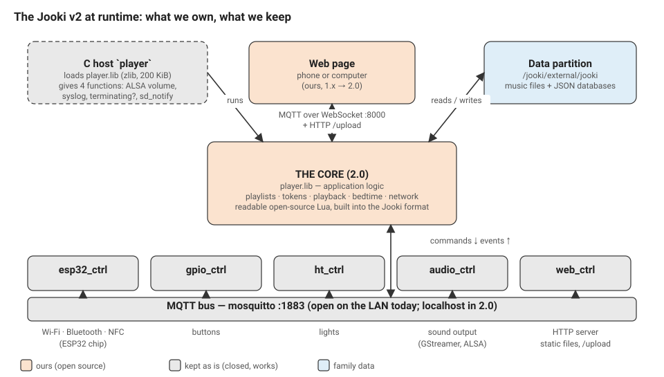
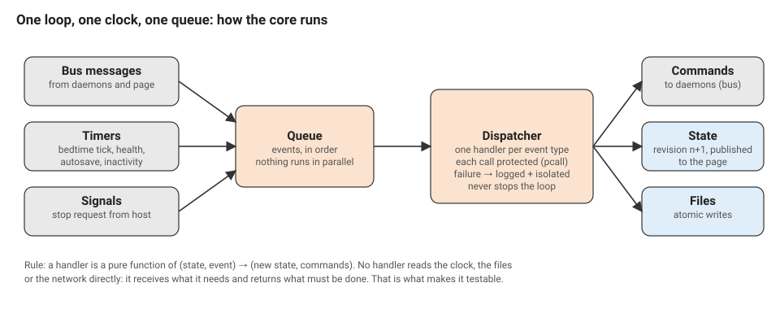
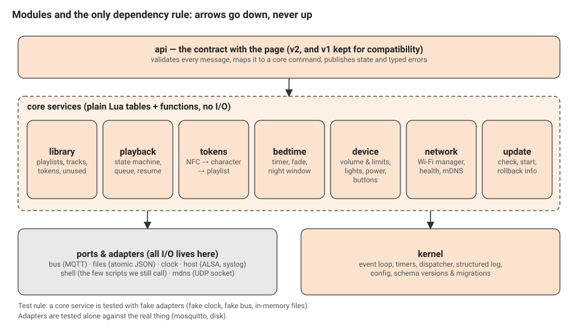
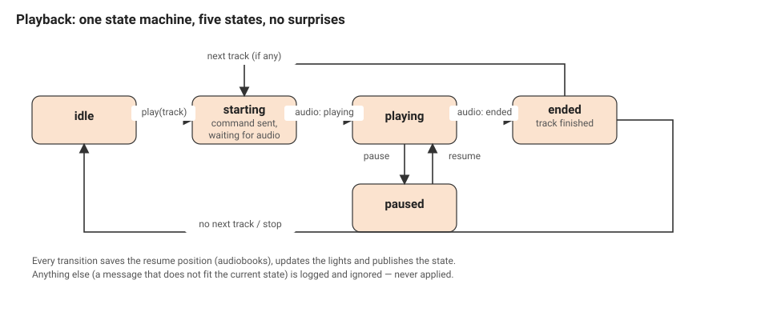
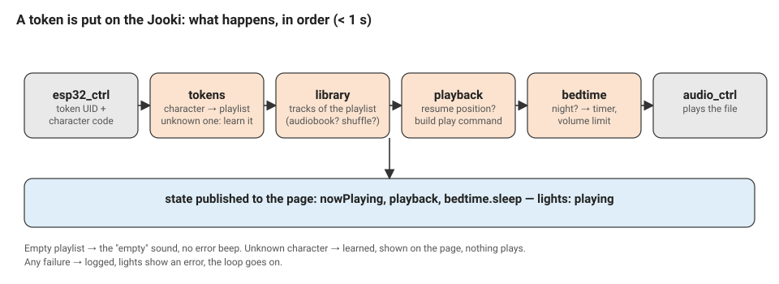
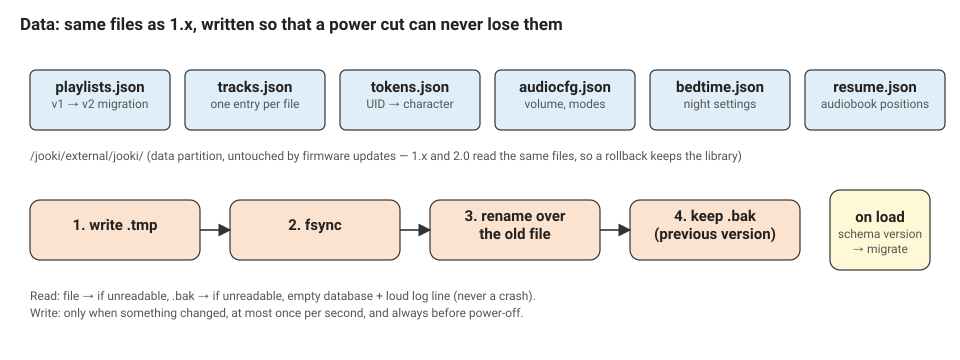
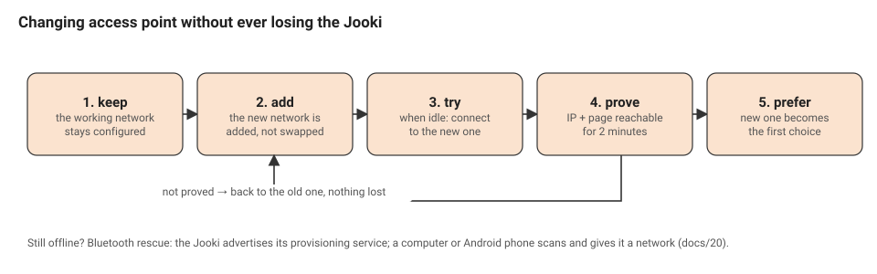
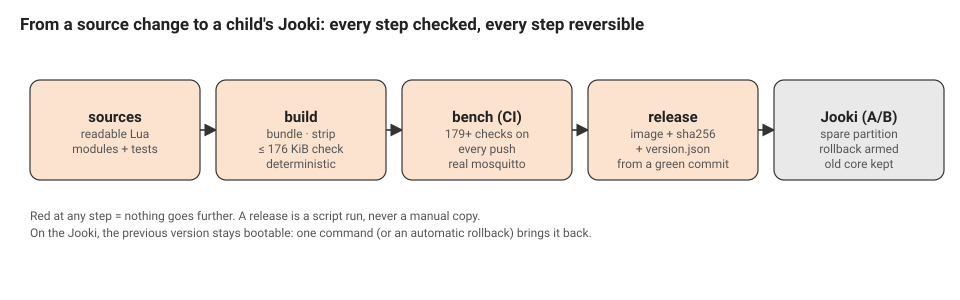

# OpenJooki 2.0 — the core, designed to last

**Status: proposal for review. Nothing here is built yet.**
Decisions to take are listed at the end (§17). The decisions already taken
and their alternatives are in `docs/adr/`. The complete analysis of the
program we replace is in `docs/22-core-inventory.md`.

How to read this: §1–§4 say *why* and *what* (10 minutes, with 3 diagrams).
§5–§12 say *how* (the design). §13–§16 say how we make sure it is right and how
we get there without risk.

---

## 1. Why a new core

Up to 1.3.0, OpenJooki keeps Muuselabs' application and changes it with 49
exact text replacements. It works, it is tested (179 checks), and it got a
family through bedtime tonight. But it is a repair, not a foundation:

- **We do not own it.** 5 500 lines of minified Lua with one-letter names,
  not redistributable, patched blind. Every feature is a fragile splice.
- **It was never designed to be testable.** State mutated from 30 closures;
  the only way to test a handler is to run the whole program with the daemons.
- **It wastes the small machine.** Three shell processes and eight synchronous
  flash writes *per second* while idle; the page gets a message every second
  while playing (docs/22 §7).
- **It forgets.** A broker hiccup exits the process; what was playing is lost.
- **It trusts everyone on the Wi-Fi** (root command execution over HTTP, open
  MQTT). Not the core's fault, but the core is what can close it.
- **Its Wi-Fi is nobody's job**: sticky to the last access point, no way to
  prefer the near one, no rescue path (we lived it on 26/09).

2.0 replaces the application layer with **our own program, open source,
designed for testing first**, and keeps everything below it (hardware daemons,
kernel, updater) untouched.

## 2. Goals and non-goals

**Goals**
1. Same behaviour for the child: tokens, playback, sounds, lights, buttons,
   bedtime — verified by the same bench as 1.3, then more.
2. A codebase a newcomer can read in an afternoon: small modules, one
   responsibility each, no globals, documented contracts.
3. Every behaviour testable without a Jooki; every release built and checked
   by a machine, not by hand.
4. Data safety: a power cut, a full disk or a broken file never loses the
   family's library; 1.x ⇄ 2.0 reversible.
5. A Jooki that manages its own Wi-Fi safely and can always be rescued.
6. Security by default: nothing on the LAN can run commands on the Jooki.

**Non-goals** (explicitly out): rewriting the closed hardware daemons or the
ESP32 firmware; supporting Spotify/Deezer/Jooki Play (dead services); a new
web page (the 1.x page keeps working through the v1 compatibility layer, and
gets a v2 client later); Jooki v1 (different hardware; a later target).

## 3. The Jooki at runtime: what we own, what we keep



We keep: the C host that loads our program (ADR-0001), the five hardware
daemons, mosquitto, the kernel, the A/B updater. We own: the core, the page,
the build and test pipeline.

## 4. Principles (and how each one is enforced)

| # | Principle | Enforced by |
|---|---|---|
| P1 | **One loop, one clock, one queue.** No threads, no callbacks from nowhere. | the kernel is the only place that reads sockets, timers and signals |
| P2 | **Handlers are pure**: `(state, event) → (state', commands)`. | core modules have no `require` of any adapter; a lint rule checks it |
| P3 | **All I/O behind ports.** Bus, files, clock, host, shell, mDNS. | one adapter per port, one fake per port for tests |
| P4 | **Fail small.** A handler error is logged, isolated, and the loop goes on; the process never exits on purpose except for power-off. | `pcall` per handler; error budget counter; no `os.exit` outside `kernel.shutdown` |
| P5 | **Data first.** Atomic writes, schema versions, migrations, backups; never a crash on bad data. | `adapters.files` is the only writer; property tests on library ops |
| P6 | **A written contract.** Every message has a schema, a version and a typed error. | `docs/api-v2.md`; schema validation at the api boundary; contract tests |
| P7 | **Budgets are tests.** Size, memory, boot time, bus traffic. | CI fails above budget |
| P8 | **No shell in the loop.** | `adapters.shell` allow-list; nothing called more than once a minute except by user action |
| P9 | **Observability is a feature.** Structured log, health on the page, a debug dump. | `kernel.log`, `state.health` |
| P10 | **Every change is reviewed and recorded.** | PR + CI green; ADR for any structural choice; CHANGELOG |

## 5. Constraints and budgets

| | value | source |
|---|---|---|
| Runtime | Lua 5.1, LuaSocket, LuaFileSystem; no C we control | C host (ADR-0001) |
| Program size | **≤ 160 KiB** stripped source (hard limit 200 KiB in the host) | docs/22 §1 |
| Memory | **≤ 4 MB** RSS steady state (1.x: 2.9 MB); no growth over 24 h | budget test |
| Boot → ready | **≤ 8 s** after process start (1.x: 10 s) | measured |
| Token → sound | **≤ 700 ms** (instrumented in the log) | to instrument |
| Bus traffic idle | **≤ 0.5 message/s** (1.x: ~4/s) | budget test |
| Shell processes idle | **0 per minute** (1.x: ~180/min) | budget test |
| Flash writes idle | **0** (1.x: ~8/s) | budget test |
| Data partition | 5.2 GB, ext4; root fs `rw,sync`; `/tmp` on root | docs/22 §1 |
| Reversibility | 1.3 and 2.0 read/write the same data files | ADR-0004 |

## 6. Runtime model



**Kernel** (`core/kernel/`):
- `loop`: `select` on the bus socket and the mDNS socket with a timeout equal
  to the next timer; drains the queue in order; one event at a time.
- `dispatch`: event type → handler; each call `pcall`ed; on error: log with
  the event, count it, publish `health.errors`; after N errors in a minute for
  the same handler, the handler is disabled until restart and the page shows
  it (no silent loops).
- `timers`: monotonic clock (uptime), registered by modules
  (`every(seconds, name)`), delivered as events like any other.
- `commands`: the handlers return a list of commands (`bus.publish`,
  `files.write`, `host.volume`, `shell.run`, `schedule`, `state.changed`); the
  kernel executes them through the adapters, in order. This is the only place
  adapters are called.
- `state`: one document, owned by the kernel, changed only through handler
  results; every change bumps `rev`; publication to the page is coalesced (at
  most 4 per second, one per 250 ms window) and diffed by sub-tree.
- `log`: levels, structured fields (`event`, `module`, `ms`), rate limit per
  key (a repeated error is logged once a minute with a count), to syslog and
  stdout; never exits.
- `config`: constants and tunables in one table with defaults, overridable by
  a file for the bench.

**Time**: `os.time()` (UTC from NTP) only for bedtime's wall-clock window;
everything else uses uptime. No handler calls either: the event carries `now`.

**Shutdown**: `SIGTERM` (host's `c_isTerminating`) → `shutdown` event → save,
lights off, `/j/all/quit` if requested, exit 0. Power-off on request runs the
sound, then the same path.

## 7. Modules



Dependency rule: `api → services → kernel/adapters`; services never import
each other's internals, they exchange events through the kernel. Each module
has a `README` (purpose, owns, events in, commands out, invariants) and a
`spec/` directory.

| Module | Owns (state) | Events in | Commands out | Invariants (tested) |
|---|---|---|---|---|
| `library` | playlists, tracks, tokens, unused | api commands, `upload.ready`, `file.probed` | `files.write`, `files.remove`, `shell.probe` | one playlist per character; no track without file; unused = tracks in no playlist; ids unique; TRASH read-only |
| `playback` | machine state, now playing, queue, positions | `audio.*`, `token.*`, transport commands, `timer` | `bus.audio.*`, `state.changed` | see §9; no command sent that the state does not allow; resume saved at every transition |
| `tokens` | last tag, learning | `nfc.tag`, `nfc.removed` | `playback.play`, `library.learn`, `nfc.write` | unknown character never errors; system tags routed to `device` |
| `bedtime` | timer, fade, night flag | `timer`, `playback.state`, api | `device.volume_limit`, `device.fade`, `playback.pause` | ported from 1.3 with its 57 unit checks |
| `device` | volume, limits, lights, power, buttons, flags | `knobs`, `gpio.*`, `power.*`, `esp32.*`, api | `host.volume`, `bus.led.*`, `shell` (toysafe, lang, poweroff) | knob value re-applied through the limit chain; long-press timing; battery thresholds |
| `network` | Wi-Fi state, preferred list, health, mDNS | `esp32.net.*`, `dhcp.*`, `timer`, api | `bus.esp32.net.*`, `mdns.answer` | safe switch (§11); never removes a working network |
| `update` | check/start status | api, `timer` | `shell.run(o.sh)` (allow-listed) | one at a time; status file for the page |
| `api` | v1/v2 translation, subscriptions | `bus.web.*` | `bus.web.state`, `bus.web.reply` | every inbound message validated against its schema |

Size targets: no module above 600 lines of readable Lua; no function above
60 lines; total readable source ≈ 6 000 lines, ≤ 160 KiB after stripping
(the build fails otherwise).

## 8. The contract (api v2)

- **Envelope** (page → Jooki, on `/j/web/v2/cmd`):
  `{"v":2, "id":"<client id>", "type":"playlist.update", "payload":{…}}`.
  Reply on `/j/web/v2/reply`: `{"v":2, "id":…, "ok":true}` or
  `{"v":2, "id":…, "ok":false, "error":{"code":"invalid_argument",
  "field":"tracks[3]", "message":"unknown track"}}`. Error codes are a closed
  list (`invalid_argument`, `not_found`, `read_only`, `conflict`,
  `unavailable`, `internal`).
- **State** on `/j/web/v2/state`: `{"v":2, "rev":1234, "full":true, …}` on
  subscribe and every 60 s; `{"rev":1235, "patch":{"playback":{…}}}` between.
  A client that sees a gap in `rev` asks for a full state. Position is a
  separate light message `/j/web/v2/position {"rev":…, "ms":…}` at most once a
  second **only while a page is connected** (the page says hello every 30 s).
- **Events** on `/j/web/v2/event`: `token.placed`, `upload.done`,
  `upload.failed{code}`, `health.warning`, for toasts.
- **v1 kept**: `/j/web/input/*` and `/j/web/output/*` are served by a
  translation table in `api` for one major release, so the 1.x page and
  community tools (Home Assistant) keep working.
- **Schemas**: one JSON Schema per message in `docs/api/v2/*.json`, used by the
  api module (a small validator, ~120 lines) and by the bench.
- The full message list is derived from docs/22 §3.2: every 1.x command that
  is not dead maps to exactly one v2 command.

## 9. Playback and the token flow



`playback` is a state machine with an explicit transition table; every
`audio.*` event is checked against the current state and the stream id
(system sound vs music) before it is applied. System sounds are a second,
tiny machine (`quiet → sounding → done`) that can interrupt and resume the
main one. Repeat, shuffle (order persisted per playlist), audiobook resume
(1.3 rules: +15 s / +60 s), "previous restarts after 5 s" are transition
rules, each with its test.



Latency budget: 700 ms from `nfc.tag` to `audio.playing`, logged as one line
with the breakdown (lookup, command, engine).

## 10. Data



- Files and formats of 1.x kept (ADR-0004) with `_.version` bumped to 2 where
  a field changes; migrations are functions `v1 → v2` tested on real copies
  (we keep anonymised snapshots of our library in the bench).
- `adapters.files.write(path, table)`: encode, write `.tmp`, `fsync`, rename,
  keep `.bak`; read: file → `.bak` → empty + error event. A checksum line in
  `_` lets us detect truncation cheaply.
- Writes are coalesced (dirty set flushed at most once a second, always on
  shutdown and before power-off).
- A nightly `self-check` event: free space, every track file present, orphan
  files, database readable; result in `state.health`.
- Track ids stay "first 16 hex of md5 of the file": that dedups uploads and
  keeps 1.x libraries valid. The md5 is computed in Lua streaming (no shell)
  — 4 MB/s on this CPU is enough for a 10 MB file in a few seconds, off the
  hot path (an upload event).

## 11. Network



- **Preferred networks**: an ordered list on the page; the Jooki keeps its
  known networks in the ESP32 as today, and applies the preference at boot and
  after a drop (the chip is sticky: docs/20 §"What we learned").
- **Safe switch**: never remove a working network before the new one is
  proved (IP obtained, page reachable for 2 minutes). Only when idle.
- **Health**: signal, drops, beacon losses, last change; shown on the page;
  a "weak" warning with advice.
- **Rescue**: the ESP32's Bluetooth provisioning (docs/20) becomes a supported
  path: a small page (Web Bluetooth, Chrome/Android) and a desktop tool in the
  repo.
- **mDNS**: `<hostname>.local` as in 1.3.
- **Power save**: an experiment (decision §17.4) with a measured battery cost.

## 12. Security

- `web_ctrl`'s root execution (`/ll`) and `/cmd/*` are **closed** for the LAN
  once the installer no longer needs them: the update channel becomes a
  command on the bus, gated by a one-time code shown on the Jooki's page (or
  a button press). First-time install of a factory Jooki still uses `/ll`
  once, from the phone installer, then closes it.
- mosquitto: 1883 bound to `127.0.0.1`; WebSocket 8000 with a per-Jooki
  password shown in Settings (stored in `/mnt/config`, changeable).
- No outbound connection except NTP and, on request, GitHub (update check).
- `adapters.shell` is an allow-list of named actions, never a free string.
- A security review is a phase gate (§15).

## 13. Engineering practices

**Repository layout**
```
core/                  the 2.0 program (readable Lua)
  kernel/  api/  services/{library,playback,tokens,bedtime,device,network,update}/
  adapters/{bus,files,clock,host,shell,mdns}/   fakes/   vendor/ (json)
  spec/                unit + property tests (busted)
tools/build/           bundle → strip → size check → player.lib (deterministic)
tools/bench/           the integration bench (from 1.x, contract v2)
docs/api/v2/           schemas;  docs/adr/  decisions;  docs/21, docs/22
```

**Code standard**: `luacheck` (no globals, no unused), a formatter (`stylua`)
in CI, `snake_case`, modules return a table, no metatable magic, every public
function documented (one line: what, inputs, errors). Max 600 lines per
module, 60 per function (CI warns, review decides).

**Reviews**: every change is a pull request with CI green; one reviewer; the
checklist: contract changed? schema + test + CHANGELOG; new I/O? behind an
adapter; new timer? budget test.

**Versioning**: semantic versions; `CHANGELOG.md` written with the change;
release notes derived from it; firmware `version.json` as today.

**ADRs**: any structural choice gets a one-page record in `docs/adr/`
(context, decision, alternatives, consequences). The first eight are written.

## 14. Test strategy



| Level | What | Runs |
|---|---|---|
| Unit (busted) | each service with fake adapters; the state machines exhaustively; property tests on library operations (no file lost, unused consistent, ids unique) | every push, < 1 min |
| Adapters | bus against a real mosquitto; files against a real disk (crash injection: kill between tmp and rename) | every push |
| Contract | every v2 message against its schema; v1 translation table | every push |
| Integration (the bench) | the whole core with the fake audio engine, real mosquitto, the page in Chromium: **the 179 checks of 1.3, rewritten to v2**, plus new ones | every push, ~6 min |
| Budgets | size, RSS after a 10-minute scripted session, bus messages/s, shell calls | every push |
| Endurance | 24 h on the bench: random tokens, uploads, network cuts, clock jumps; memory flat, no error budget exceeded | nightly |
| Device | A/B install on our Jooki, 24 h measurement, forced rollback | each release candidate |

**The oracle rule**: before switching, the new core must pass the *same*
integration checks as the old core through the compatibility layer. Any
behaviour difference is either a documented improvement (with a test) or a
bug.

## 15. Migration plan

| Phase | Deliverable | Exit criterion |
|---|---|---|
| 0 | this document, `docs/api-v2.md`, ADRs reviewed | approved by the maintainer |
| 1 | build pipeline, kernel, adapters + fakes, log, config, CI skeleton | boots on the bench, answers a v2 `state.get`; budgets measured |
| 2 | library, tokens, playback, device (volume, lights, buttons, power) | unit + property green; 1.x backend checks green through v1 layer |
| 3 | bedtime, update, network (health, mDNS), api v1+v2 complete | **all 179 checks green on the new core**; endurance 24 h green |
| 4 | Wi-Fi manager + Bluetooth rescue page; security (§12) | new checks green; security review signed |
| 5 | our Jooki: A/B install, 24 h, rollback test, family use for a week | no regression, no data change, family approval |
| 6 | release 2.0 (old core kept on the spare partition for one release) | published; installer + OTA verified |

Order of work inside a phase: contract → tests → code. Effort: phases 1–3 are
the bulk (the old program is 5 500 lines; ours will be about 6 000 readable
ones with tests of similar size); phases 4–6 are shorter but calendar-bound
(24 h runs, a week of family use).

## 16. Risks and mitigations

| Risk | Mitigation |
|---|---|
| A behaviour of the old core we did not notice | the oracle rule; docs/22 read in full; the old core stays on the spare partition |
| Size budget exceeded | measured from phase 1; strip step; vendor only what is needed; no third-party MQTT/JSON heavyweights |
| Lua 5.1 limits (no integers, `#` on holes, no goto) | coding standard; luacheck; tests |
| A daemon behaves differently from the bench emulation | device phase with real logs; emulation refined from device captures (we already capture the bus) |
| Losing the Jooki during network work | safe switch rule; Bluetooth rescue tested before phase 4 ships |
| The maintainer's time | phases are independently shippable; 1.3 stays supported |

## 17. Decisions needed from the maintainer

1. **Scope**: full 2.0 (phases 1–6), or ship the new core first (1–3, same
   features as 1.3) and Wi-Fi manager + security as 2.1? *Recommendation:*
   1–3 first; a smaller first switch is safer, and 4 depends on it anyway.
2. **Closing `/ll`**: acceptable that a factory Jooki's first install keeps one
   `/ll` call, after which it is closed, and that later updates need a code
   shown on the Jooki's page? *Recommendation:* yes.
3. **Drop Spotify/Deezer/Jooki Play/cloud/Mender code paths** (dead services)?
   *Recommendation:* yes, with the data fields kept so old files still load.
4. **ESP32 power-save experiment** on our Jooki (reversible; battery cost
   measured before any release)? *Recommendation:* yes, in phase 4.
5. **Language of the code and docs**: English throughout (public project),
   French summaries in the README for parents? *Recommendation:* yes.

---

Glossary: **core** = the application program loaded by the C host; **daemon**
= a closed hardware program (esp32_ctrl…); **bus** = mosquitto; **page** = the
web UI; **bench** = the off-device test rig; **A/B** = the two root
partitions with U-Boot rollback; **adapter** = the only code allowed to do I/O;
**handler** = a pure function that turns an event into state and commands.
