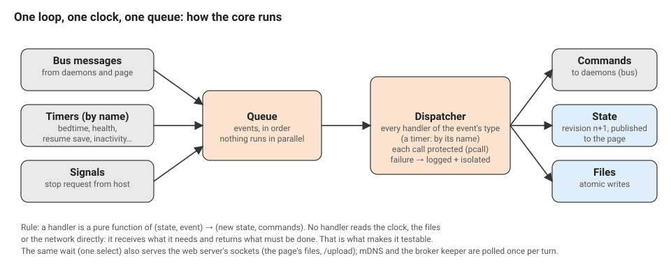
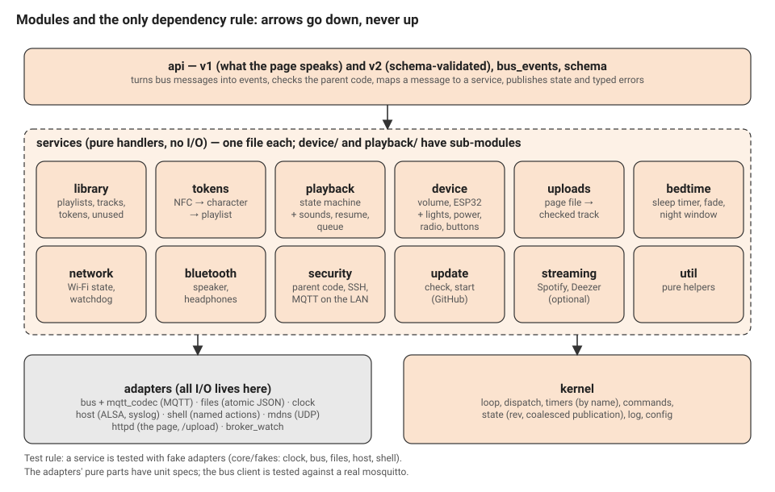
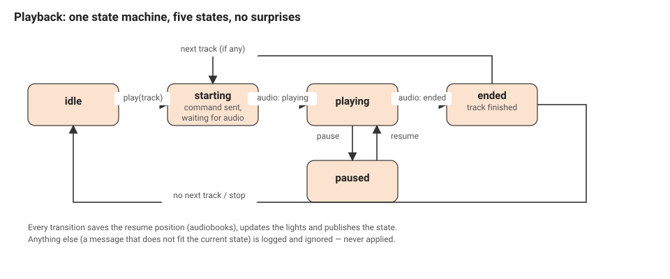
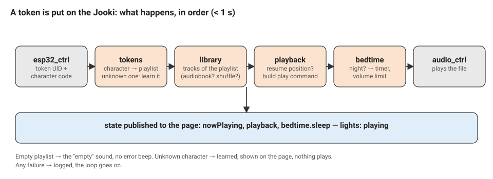
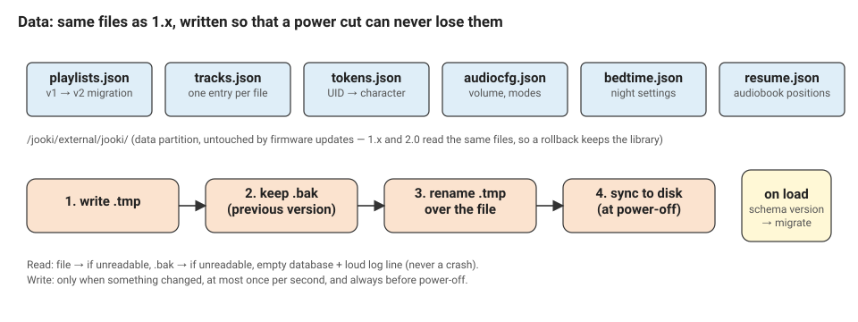
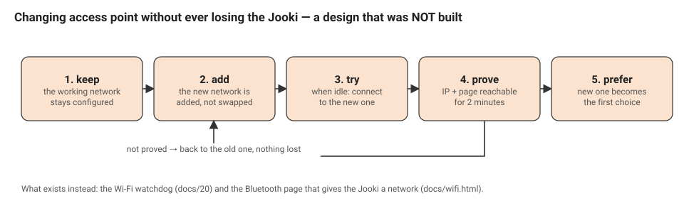
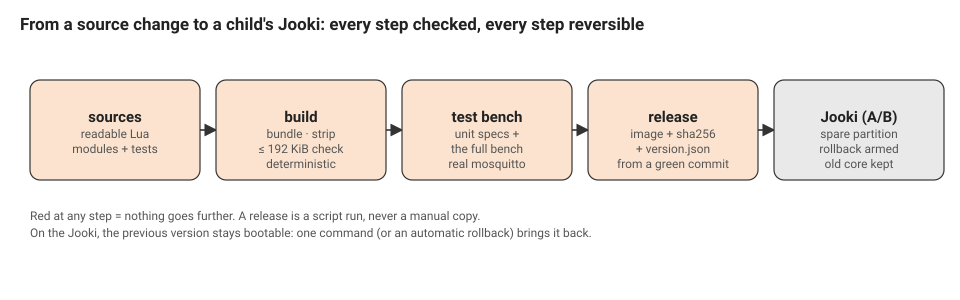

# OpenJooki 2.0 — the core, designed to last

**Status: built and shipped.** Approved by the maintainer on 2026-09-26, released as 2.0.0 on
2026-09-27; this page describes the core **as it is in release 2.2.7**. §1–§2 are the case that
was made for it (kept as written); §3–§14 say what is built, read from the code; §15 keeps the
history of the plan and lists what was planned and never built; §16–§17 are the risks and the
decisions as they were taken, with what became of them. The decisions and their alternatives are in
`docs/adr/` (the index says where a record was built differently). The complete analysis of the
program we replaced is in `docs/22-core-inventory.md`.

How to read this: §1–§4 say *why* and *what* (10 minutes, with 3 diagrams).
§5–§12 say *how* (the design, as built). §13–§14 say how we make sure it is right.

---

## 1. Why a new core

Up to 1.3.0, OpenJooki keeps Muuselabs' application and changes it with 49
exact text replacements. It works, it is tested (179 checks), and it got a
family through bedtime tonight. But it is a repair, not a foundation:

- **We do not own it.** 5 500 lines of minified Lua with one-letter names,
  not redistributable, patched blind. Every feature is a fragile splice.
- **It was never designed to be testable.** State mutated from 30 closures;
  the only way to test a handler is to run the whole program with the daemons.
- **It wastes the small machine.** Three shell processes and eight synchronous
  flash writes *per second* while idle; the page gets a message every second
  while playing (docs/22 §7).
- **It forgets.** A broker hiccup exits the process; what was playing is lost.
- **It trusts everyone on the Wi-Fi** (root command execution over HTTP, open
  MQTT). Not the core's fault, but the core is what can close it.
- **Its Wi-Fi is nobody's job**: sticky to the last access point, no way to
  prefer the near one, no rescue path (we lived it on 26/09).

2.0 replaces the application layer with **our own program, open source,
designed for testing first**, and keeps everything below it (hardware daemons,
kernel, updater) untouched.

## 2. Goals and non-goals

**Goals**
1. Same behaviour for the child: tokens, playback, sounds, lights, buttons,
   bedtime — verified by the same bench as 1.3, then more.
2. A codebase a newcomer can read in an afternoon: small modules, one
   responsibility each, no globals, documented contracts.
3. Every behaviour testable without a Jooki; every release built and checked
   by a machine, not by hand.
4. Data safety: a power cut, a full disk or a broken file never loses the
   family's library; 1.x ⇄ 2.0 reversible.
5. A Jooki that manages its own Wi-Fi safely and can always be rescued.
6. Security by default: nothing on the LAN can run commands on the Jooki.

**Non-goals** (explicitly out): rewriting the closed hardware daemons or the
ESP32 firmware; Jooki Play and the Muuselabs cloud (dead services with
hard-coded keys); a new web page (the 1.x page keeps working through the v1
compatibility layer, and gets a v2 client later); Jooki v1 (different
hardware; a later target). **Spotify Connect and Deezer are kept** as an
optional `streaming` module (decision of the maintainer, §17.3): the closed
`spotify_ctrl` daemon is still on the device and some families may use it;
we port the message paths as they are, mark them "best effort" (no account to
test with), and never let them affect the rest.

## 3. The Jooki at runtime: what we own, what we keep


We keep: the C host that loads our program (ADR-0001), the closed hardware
daemons (`esp32_ctrl`, `gpio_ctrl`, `ht_ctrl`, `audio_ctrl`, and `spotify_ctrl`
for the optional streaming), mosquitto, the kernel, the A/B updater. We own: the
core, the page, the build and test pipeline. The closed web server `web_ctrl`
is **no longer started** since 2.1.0 (`tools/openjooki/system/ml-start-app.sh`):
the core serves the page and `/upload` itself (`core/adapters/httpd.lua`, ADR-0007).

The diagrams of this page are generated by `tools/diagrams/gen_arch_diagrams.py`
(plain SVG, written to `docs/img/arch/`); `tools/diagrams/make_phone_shots.py`
makes the phone screenshots of the parents' guide.

## 4. Principles (and how each one is enforced)

| # | Principle | Enforced by |
|---|---|---|
| P1 | **One loop, one clock, one queue.** No threads, no callbacks from nowhere. | `kernel.loop` is the only place that waits on sockets and fires timers |
| P2 | **Handlers are pure**: `(doc, event) → { state, commands }`. | no service `require`s an adapter (true in the code today; kept by review: there is no lint rule for it). One adapter requires a service: `adapters.shell` takes `is_pubkey` from `services.security`, a pure function |
| P3 | **All I/O behind ports.** Bus, files, clock, host, shell, mDNS, the web server (`httpd`), the broker keeper (`broker_watch`); `mqtt_codec` is the bus's pure packet codec. | one adapter per port; `core/fakes/` has the in-memory bus, files, clock, host and shell for the specs |
| P4 | **Fail small.** A handler error is logged, isolated, and the loop goes on; the process never exits on purpose except for power-off. | `pcall` per handler and per loop turn; an error budget per module; the loop stops only on a `shutdown` command (`kernel/commands.lua`) |
| P5 | **Data first.** Atomic writes, a `.bak` of the previous file, a sum that detects truncation; never a crash on bad data. | `adapters.files.write` is the only writer of the family's JSON files; specs on the library operations |
| P6 | **A written contract.** Every v2 command has a schema and a typed error. | `docs/api-v2.md`, generated from the code and compared in CI; validation in `api/v2.lua` |
| P7 | **Budgets are tests.** Size, memory, idle bus traffic. | `bundle.py --max-kib 400` and `core/spec/integration/smoke.py` in CI. Shell processes are counted (`health.shell_calls`) but no test checks the count |
| P8 | **No shell in the loop.** | `adapters.shell` is a list of named actions with checked arguments; no timer runs one, except when something is wrong (the broker keeper, the Wi-Fi watchdog) and once per start (the factory network forgotten a minute after the Wi-Fi is up) |
| P9 | **Observability is a feature.** Structured log, health in the state. | `kernel.log`, `state.health` (RSS, uptime, bus statistics, shell calls, boot timeline, every 60 s) |
| P10 | **Every change is recorded.** | CI green; ADR for any structural choice; CHANGELOG |

## 5. Constraints and budgets

| | value | source |
|---|---|---|
| Runtime | Lua 5.1, LuaSocket, LuaFileSystem; no C we control | C host (ADR-0001) |
| Program size | Core in its own file `/jooki/lib/core.lua` since **ADR-0011**; `player.lib` is a small loader that reads and runs it, so the host's 200 KiB buffer no longer bounds the core (only the loader). CI builds with a 400 KiB guard (`bundle.py --max-kib 400`; the tool's own default is 512); the stripped core of 2.2.7 is about 218 KiB. The 192 KiB budget of ADR-0010 no longer binds. The v1 layer is still part of the core (§8); `streaming` can be left out with `--without services.streaming` | `.github/workflows/ci.yml`, `tools/build/bundle.py` |
| Memory | **≤ 4 MB** RSS steady state on the device (1.x: 2.9 MB) | measured on the device (2.9 MB); on the x86-64 bench `smoke.py` checks < 6 MB, and the nightly endurance run checks it does not grow |
| Boot → ready | **≤ 8 s** after process start (1.x: 10 s) | measured: `health.boot` carries the timeline |
| Token → sound | **≤ 700 ms** | a target; not instrumented (§9) |
| Bus traffic idle | **≤ 0.5 message/s** (1.x: ~4/s) | `smoke.py` |
| Shell processes idle | **0** (1.x: ~180/min) | by construction (§4, P8); counted in `health.shell_calls`, not checked by a test (`smoke.py`'s header says it is; its checks do not) |
| Flash writes idle | **0** (1.x: ~8/s) | by construction: files are written by commands, and the resume save timer writes only when a position changed |
| Data partition | 5.2 GB, ext4; root fs `rw,sync`; `/tmp` on root | docs/22 §1 |
| Reversibility | 1.3 and 2.x read/write the same data files | ADR-0004 |

## 6. Runtime model



**Kernel** (`core/kernel/`):
- `loop`: one turn = keep the bus alive (`bus:maintain`), take the queued events
  and the due timers, wait in **one `select`** on the bus socket and the web
  server's sockets (`io_sources` / `io_ready`, given by `main.lua`) for at most
  the time to the next timer (never more than `tick_s`, 0.5 s), translate the bus
  messages into events, run `each_turn`, then handle the events one at a time.
  `each_turn` is where `main.lua` polls what has no event: the web server's
  timeouts and its port retry (`httpd:tick`), the broker keeper
  (`broker_watch:check`), and mDNS (`mdns:serve`: the mDNS socket is **not** in
  the `select`; it is read and the name announced once per turn).
- `dispatch`: event type → the handlers registered for it (several modules may
  handle the same event; all run, in registration order), each call `pcall`ed.
  On error: logged with the module and the event, counted; more than
  `error_budget_per_minute` (20) errors in a minute for the same module and the
  module is disabled until restart, and the loop sets
  `health = { degraded = true, module = … }` in the state.
- `timers`: on the uptime clock, by **name**: `timers.every(name, seconds, now)`
  and `timers.once(name, seconds, now)`, cancelled by name. A due timer is an
  event `{ type = "timer", name = … }`; a module takes one timer with
  `dispatch.on_timer(name, module, fn)` and never tests the name (a handler on
  the plain `timer` type would see them all; none does). Handlers start and stop
  timers with commands.
- `commands`: what a handler returns besides state. The kinds, each with a
  strict shape, an unknown one being logged and never run: `bus.publish`,
  `files.write`, `files.remove`, `files.read_text`, `files.write_text`,
  `files.flag`, `files.rename`, `files.stat`, `host.volume`, `shell` (a named
  action; with `reply`, its output comes back as an event), `timer.every`,
  `timer.once`, `timer.cancel`, `emit` (an event for the next turn), `log`,
  `shutdown`. This is the only place where adapters are called **with the result
  of business logic**; the loop itself calls the bus (`maintain`, `poll`) and
  `main.lua`'s `each_turn` calls `httpd`, `mdns` and `broker_watch`.
- `state`: one document, changed only through handler results (a handler
  returns whole top-level sub-trees); every change bumps `rev`. Publication is
  coalesced: at most one per `state_publish_min_interval_s` (0.25 s), carrying
  the sub-trees that changed. A publication held back by the window does not
  wait for the next event: the loop shortens its wait and **wakes up when the
  window ends**. Some sub-trees are private and never published
  (`api.published`): `config`, `activity`, `system` and every `<module>_int`.
- `log`: levels, a stable key and flat fields per line, rate limit per key and
  level (after 5 lines in 60 s, one line per window with the number suppressed),
  to stdout and syslog; never exits. `JOOKI_LOG_LEVEL=debug` or `OPENJOOKI_LOG`
  set the level.
- `config`: every tunable in one table with its default
  (`core/kernel/config.lua`); unknown keys and wrong types are refused. It is
  overridden by a JSON file named by the `OPENJOOKI_CONFIG` environment variable
  (the bench uses it; a Jooki has none), and `OJ_HTTP_PORT` moves the web server
  off port 80 on the bench. Off a real Jooki, `main.lua` turns the two watchdogs
  and the Wi-Fi light chase off. The configuration is copied into the state as
  the private sub-tree `config`: **handlers read `doc.config`**
  (`services/util.lua`: `data_dir`, `scratch_dir`), never `kernel.config`.

**Boot**: `main.lua` is wiring only. It reads the family's files, the flags
of `/data/mode` and the security files (`/data/openjooki/parent_code`,
`mqtt_lan`, `authorized_keys`) itself and puts their content in the one `boot`
event, so the boot handlers do no I/O either.

**Time**: every event carries `now` (uptime); the boot event and those that
come from the bus also carry `wall` (`os.time()`, UTC), used by bedtime's night
window, the ids and a few end times. Timer events carry no `wall`, so the purity
rule has its exceptions, all in the bedtime and clock paths: bedtime's 15 s
`bedtime.clock` timer lets `os.date` read the clock, and its reaction to
`clock.set` calls `os.time()` (`device.on_clock` does too, as a fallback).

**Shutdown**: the host's `c_isTerminating` → `host.terminating` event →
`device.power` saves `audiocfg.json`, turns the lights off, publishes
`/j/all/quit`, runs `sync` and returns the `shutdown` command (the resume
position is flushed by `playback.resume` on the same event). Power-off on
request plays the sound first (`power.off_request` → `system.event` →
`shutdown.request`), then the same path plus `poweroff`.

**When the broker is down**: the bus adapter reconnects with a backoff (1 to
30 s); after `broker_watch_s` (20 s) without the bus, `adapters.broker_watch`
starts mosquitto again if it is not running, with the hardware controllers that
left with it (shell action `broker_start`), then at most once a minute. The web
server, if port 80 was still held at start, tries again by itself (5 s, doubling
to 60 s). Details and the field history: [20-network-health.md](20-network-health.md).

## 7. Modules



Dependency rule: `api → services → kernel`; the adapters are reached through
commands. Services exchange events through the kernel; the direct calls that
exist are few and one-way: `api.v1` calls the services' handlers, `tokens` and
`uploads` use `library.mutate`, `streaming` goes through `playback.on_external`
(and `playback` asks `streaming` for the daemons' transport commands), and a
sub-module reaches its facade at call time. Each module's header comment says
what it owns; its specs are in `core/spec/` (`services/util.lua` has none of its
own). One file per module; only `device/` and `playback/` are folders.

| Module (`core/services/…`) | Owns (state) | Events in | What it sends |
|---|---|---|---|
| `library` | `library` { playlists, tracks, tokens } | `boot`, `library.add_playlist`; v2 `playlist.new/delete/update/add_track/add_stream`, `token.edit/forget` (v1 and other services call `library.mutate` / `library.ops`) | `files.write` (playlists.json, tracks.json, tokens.json), `files.remove` |
| `tokens` | `nfc` { starId, tagId } | `nfc.tag`, `nfc.removed`, `nfc.written`, `tokens.image_moved` | events `playback.request`, `playback.pause_request`, `system.tag`, `system.event`; `files.rename` / `files.remove` (a token's photo); tokens.json through `library.mutate` |
| `playback` (facade) | `playback` (published), `playback_int` (private) | `boot`, `playback.request`, `playback.pause_request`, `playback.next`, `playback.prev`, `audio.starting/playing/paused/stopped/ended/position`; v2 `playback.play/pause/resume/next/prev/seek/skip/stop` | `bus.publish` to `audio_ctrl` (stream 7 = music), events `playback.changed`, `system.event`; `playback.on_external` is the one door for streaming (§9) |
| `playback.sounds` | `system` (the sound catalogue, private), `playback_int.sys` | `boot`, `system.event`; `audio.*` on stream 3 through the facade | `audio_ctrl` on stream 3, event `lights.event`, then the event's own `after` |
| `playback.resume` | `resume` (resume.json), `playback_int.resume_dirty` | `boot`, timer `playback.save` (60 s), `host.terminating`; v2 `playback.resume_reset` | `files.write` (resume.json) |
| `playback.queue` | nothing (pure: the order in `playback_int.shuffle`) | called by the facade | — |
| `device` (facade) | `audiocfg`, `device` (esp32_up, diskUsage, hostname…); applies `limits` | `boot`, `bus.up`, `gpio.volume`, `knobs`, `volume.apply`, `limits.changed`, `upload.done`, `device.df`, `device.set_config_request`, timers `device.knobs` (10 s) and `device.esp32_init.N`; v2 `device.set_volume/set_config/set_name/clock/speak_info`, `device.set_wifi` (always refused) | `host.volume`, `bus.publish` (ESP32 orders), `shell` (`df`, `set_clock`, `set_name`, `speak_info`), `files.write` (audiocfg.json), events `audiocfg.changed`, `clock.set`, `system.event` |
| `device.lights` | `device.party` flag only | `boot`, `lights.event`, `playback.changed`, `net.status`, `limits.changed`, timers `device.wifi_anim`, `device.party`, `device.party_end`; v2 `device.party` | `bus.publish` (LED frames) |
| `device.power` | `power`, `activity` (private) | `boot`, `power.battery/plugged/charging`, `power.off_request`, `shutdown.request`, `host.terminating`, activity (`nfc.tag`, `api.cmd`, `v1.cmd`, `playback.request`), timer `device.inactivity` (30 s); v2 `device.power_off` | `shell` (`poweroff`, `sync`, `power_overheat`), `files.write` (audiocfg.json at shutdown), events `system.event`, `lights.event`, `power.off_request`, `device.toy_safe_request`, the `shutdown` command |
| `device.radio` | `device.toy_safe`, `device.airplane`, `flags` | `boot`, `radio.set`, `system.tag`, `device.toy_safe_request`, timers `device.airplane`, `device.airplane_restore`; v2 `device.toy_safe`, `device.airplane` | `files.flag`, `shell` (`radio`, `toysafe_update`), `bus.publish`, event `lights.event` |
| `device.buttons` | `activity.buttons`, `activity.last` | `gpio.button`, timer `device.tick` (0.5 s, only while a button is held) | events `playback.next`, `playback.prev`, `playback.pause_request`, `power.off_request`, `radio.set`, `security.parent_clear`; `shell` (`speak_info`) |
| `uploads` | nothing of its own (the track goes into `library`) | `upload.add` (v2 command and v1 `PLAYLIST_ADD_UPLOAD`), then its own chain `upload.hashed`, `upload.renamed`, `upload.probed`, `upload.meta` | `shell` (`md5`, `probe_audio`), `files.rename/read_text/remove`, events `user.message`, `upload.done` |
| `bedtime` | `bedtime` { cfg, night, sleep }, `bedtime_int`; drives `limits` { maxvol, fade, dim } | `boot`, timers `bedtime.clock` (15 s) and `bedtime.tick` (0.5 s, only while a sleep timer runs), `clock.set`, `playback.changed`; v2 `bedtime.sleep`, `bedtime.set` | `files.write` (bedtime.json), events `limits.changed`, `playback.pause_request` |
| `network` | `net`, `net_watch` (the Wi-Fi watchdog's count) | `boot`, `net.status` (from the ESP32), timers `network.status` (30 s) and `network.wifi_log` (20 s), their replies `network.route`, `network.wifi_log`. No command from the page | `bus.publish` (asks the chip its status), `files.read_text` (`/proc/net/route`, `/tmp/oj-wifi.log`), `files.write_text`, `shell` (`log_cleanup`, `wifi_forget_factory`, `watchdog_reboot`) |
| `bluetooth` | `bluetooth` | `boot`, `bt.state`, `bt.connected`, `bt.discovered`, `bt.saved`, timers `bluetooth.poll` (30 s), `bluetooth.scan_end`; v1 only: `OJ_BT_SCAN/CONNECT/FORGET` | `bus.publish` to `esp32_ctrl` |
| `security` | `maintenance` { ssh, ssh_until, ssh_keys, mqtt_lan, parent }; the parent code itself stays in memory | `boot`, timer `security.ssh_off` (one hour), `security.parent_clear` (the buttons); v1 only: `OJ_SSH_ON/OFF/KEY`, `OJ_MQTT_LAN`, `OJ_PARENT_SET/CLEAR`. `security.gate` is asked by `api.v1` and `api.v2` | `shell` (`ssh_on`, `ssh_off`, `ssh_key_add`, `ssh_key_clear`, `mqtt_lan`), `files.write_text` / `files.remove` (the parent code), event `system.event` |
| `update` | nothing | `update.check`, `update.start` (from v1 `OJ_UPDATE_*`); v2 `update.check`, `update.start` | `shell` (`update_check`, `update_start`) with the two addresses of the configuration (§12) |
| `streaming` (optional) | `spotify`, `deezer`, `streaming_int` | `boot`, `spotify.*`, `deezer.*`, `audiocfg.changed`, `net.status`; v2 `spotify.new_playlist`, `deezer.get_playlists`, `deezer.set_config` | `bus.publish` to the daemons, events `library.add_playlist`, `device.set_config_request`, `volume.apply`, `system.event`; what a daemon plays reaches `playback` through `playback.on_external` only |
| `util` | nothing (pure helpers: deep copy, the `emit` command, `data_dir`, `scratch_dir`, the typed error, "is something playing") | — | — |
| `api.v2` (`core/api/v2.lua`) | the command registry, the parent-code guard | `api.cmd` (`/j/web/v2/cmd`) | `/j/web/v2/reply`, `/j/web/v2/state`, `/j/web/v2/event` |
| `api.v1` (`core/api/v1.lua`) | `userMessages` | `v1.cmd` (`/j/web/input/<NAME>`), `user.message`, `v1.force_publish`, `upload.done` | `/j/web/output/state` (the 1.x document rebuilt from ours), `/j/web/output/error` |
| `api.bus_events`, `api.schema` | nothing | every other bus topic → a typed event; the small schema validator | — |

`main.lua` owns `health` (a timer of its own, every 60 s).

Size: there is no per-module or per-function limit checked anywhere; the
largest module today is `services/playback.lua` (435 lines). The only size
check is the 400 KiB guard on the stripped core (§5).

## 8. The contract

Two contracts are served side by side, from the same handlers.

**v1** (`/j/web/input/<NAME>`, `/j/web/output/state`, `/j/web/output/error`) is
the 2018 contract, extended with the `OJ_*` messages. It is **what the page
speaks today** and what community tools (Home Assistant) know; it was to be
kept for one release and is still there in 2.2.7. Described in
[11-content-api.md](11-content-api.md); served by `core/api/v1.lua`. The
security switches (`OJ_SSH_*`, `OJ_MQTT_LAN`, `OJ_PARENT_*`), Bluetooth
(`OJ_BT_*`), a token's photo (`TOKEN_SET_IMAGE`), `MESSAGE_DISMISS` and
`SWITCH_LOCALE` exist **only in v1**.

**v2** (`core/api/v2.lua`; the generated reference is [api-v2.md](api-v2.md)):

- **Envelope** (on `/j/web/v2/cmd`):
  `{"v":2, "id":"<client id>", "type":"playlist.update", "payload":{…}, "code":"1234"}`
  (`code`: the parent code, needed by the protected commands when one is set).
  Reply on `/j/web/v2/reply`: `{"v":2, "id":…, "ok":true}` or
  `{"v":2, "id":…, "ok":false, "error":{"code":"not_found",
  "field":"type", "message":"unknown command …"}}`. Error codes: `invalid_argument`,
  `not_found`, `forbidden` (the parent code: `PARENT_CODE_REQUIRED`),
  `read_only`, `conflict`, `unavailable`, `internal`.
- **State** on `/j/web/v2/state`: a full document
  `{"v":2, "rev":n, "full":true, "state":{…}}` in answer to `state.get` (there
  is no periodic full state), and patches `{"v":2, "rev":n, "patch":{key: value}}`
  with the top-level sub-trees that changed. A change to private keys only still
  goes out as an empty patch, so a client sees no gap in `rev`; one that does
  see a gap asks `state.get`. The position is part of `playback` (no separate
  channel).
- **Events** on `/j/web/v2/event`: only `core.version` is emitted today.
- **The parent-code gate**: `main.lua` gives the api a guard
  (`api.set_guard`) that asks `security.gate(security.PROTECTED_V2, type, code)`
  before any command runs; the protected set is what changes the Jooki's content
  or set-up (playlists, tokens, uploads, configuration, name, airplane mode,
  power-off, bedtime settings, updates, streaming accounts). Playing, the volume
  and the sleep timer stay open. v1 has its own list of message names
  (`v1.PROTECTED`) and asks the same gate.
- **Schemas**: Lua tables next to each command (`api.command(type, schema, fn)`),
  checked by `core/api/schema.lua`, a small validator of the JSON-Schema subset
  we use. `tools/build/apidoc.lua` prints them into `docs/api-v2.md`, and CI
  fails when that file is not what the code gives.

## 9. Playback and the token flow



`playback` is a state machine (`idle`, `starting`, `playing`, `paused`,
`ended`); every `audio.*` event is checked against the stream id (3 = system
sound, 7 = music) and the current state before it is applied. System sounds are
a second, tiny machine (`services/playback/sounds.lua`) that pauses the music,
plays, continues it and then runs the event's `after`. Repeat, shuffle (an order
memoised per playlist in `playback_int.shuffle`, in memory only: a restart draws
a new one from a seed set at boot from the clock; never for an audiobook),
audiobook resume (the 1.3 rules: 15 s back after a long pause, 60 s after the
sleep timer) and "previous restarts the track after 5 s" each have their spec.

**Streaming has one door.** What the Spotify or Deezer daemon says about the
track *it* plays reaches `state.playback` through `playback.on_external` only
(`services/streaming.lua` calls it): `takeover` stops the local music (the last
one to start wins), `now` / `clear` set what plays, `state` raises
`playback.changed`. `playback` stays the only writer of its sub-tree, and while
a daemon plays, late reports of the local engine are ignored.



The 700 ms target from `nfc.tag` to `audio.playing` (§5) is not instrumented:
no log line measures it.

## 10. Data



- Files and formats of 1.x kept (ADR-0004): every file is written with
  `_.version = 1`. There are no migrations; none has been needed.
- `adapters.files.write(path, table, version)`: encode with sorted keys, write
  `.tmp`, keep the old file as `.bak`, rename `.tmp` over it. An Adler-32 sum of
  the body in `_` detects truncation. Read: file → `.bak` → nothing (logged at
  boot by `main.lua`, the module starts empty). A file that does not parse or
  whose sum is wrong counts as missing, so a truncated write falls back to
  `.bak`; a 1.x file without a sum is read as is. There is no `fsync` per write:
  the filesystem commits on its own within seconds, and a `sync` runs at shutdown.
- Writes go out **with the command that changes the data** (a playlist edit
  writes playlists.json at once); they are not coalesced. The one exception is
  the audiobook position: noted in memory at every report and written by the
  `playback.save` timer (60 s) when it changed, at every pause or stop, and at
  shutdown.
- Track ids stay "first 16 hex of md5 of the file": that dedups uploads and
  keeps 1.x libraries valid. The md5 is computed by `md5sum` (shell action
  `md5`), off the hot path: once per upload.

## 11. Network

- **State and health** (`services/network.lua`): what the ESP32 reports
  (`net.status`: SSID, BSSID, channel, signal, address) is asked every 30 s and
  published as `net`, with the drops and beacon losses counted in
  `/tmp/oj-wifi.log` (read every 20 s) and whether Linux has a default route
  (`/proc/net/route`, read every 30 s; no DHCP event is subscribed to).
- **Wi-Fi watchdog**: offline 10 minutes with the radios on, nothing playing
  and on the charger → the Jooki restarts itself, silently, at most twice in a
  row (`wifi_watchdog_s`, `wifi_watchdog_max`).
- **The factory network** (`mnet2`) is forgotten once, a minute after the Wi-Fi
  is up, when another network is known.
- **The name**: `adapters/mdns.lua` answers `<name>.local` from the loop and,
  since 2.2.2, also **announces** it unasked (at start, on every address change
  and every 30 s), because the chip misses most multicast questions. The name
  can be chosen on the page (`device.set_name` → shell `set_name`, kept in
  `/data/openjooki/hostname`).
- **Giving the Jooki a network** is not the core's job: `device.set_wifi` is
  always refused; a Jooki 2 learns a network over Bluetooth
  ([wifi.html](wifi.html), `tools/wifi/`).
- **The broker**: see §6.



The diagram above is the **design that was not built**: an ordered list of
preferred networks and a "safe switch" between access points (§15). Field
notes and what the chip really does: [20-network-health.md](20-network-health.md).

## 12. Security

As built ([ADR-0007](adr/0007-security-model.md), complete since 2.1.0):

- `web_ctrl` is not started any more, so its root execution (`/ll`) and
  `/cmd/*` are **gone**, not fenced. `adapters.httpd` serves the page's files
  and `POST /upload`, nothing else, and refuses a `Host` that is not the
  Jooki's own name, a `.local` name, an IP address or localhost. A factory
  Jooki's first install still goes through the factory image's `/ll`
  ([16-phone-install.md](16-phone-install.md)).
- mosquitto: 1883 bound to `127.0.0.1` (the core and the daemons, anonymous);
  WebSocket 8000 with a per-Jooki password, generated once in
  `/data/openjooki/ws_secret` by `tools/openjooki/system/oj-security.sh` at boot
  and served to the page at `/oj-auth.json` (same origin).
- **Parent code** (optional, 4 digits, `/data/openjooki/parent_code`): when set,
  the commands that change the Jooki must carry it, in v1 and in v2 (§8); held
  in memory, never published (`maintenance.parent` only says one is set).
  Holding *previous* and *next* for 10 s clears it.
- Off by default, on the page's Settings: maintenance SSH (dropbear on 2222,
  closes itself after one hour; public keys kept on `/data`) and MQTT on the LAN
  for home automation (a listener on the Wi-Fi address, with the password).
- `adapters.shell` is a list of named actions with checked arguments, never a
  free string.
- **Updates**: the two addresses are configuration keys (`update_manifest_url`,
  `update_script_url`) and the shell actions accept only our GitHub
  (`github.com/Guillain-RDCDE/OpenJooki/`, `guillain-rdcde.github.io/OpenJooki/`)
  or `http://127.0.0.1:<port>/` for the bench (`shell.is_update_url`).
- No outbound connection except NTP and, on request, GitHub (update check).

## 13. Engineering practices

**Repository layout**
```
core/                  the program (readable Lua)
  main.lua             wiring only
  kernel/              loop, dispatch, timers, commands, state, log, config
  api/                 v2, v1, bus_events, schema
  services/            library, tokens, playback (+ playback/), device (+ device/), uploads,
                       bedtime, network, bluetooth, security, update, streaming, util
  adapters/            bus, mqtt_codec, files, clock, host, shell, mdns, httpd, broker_watch
  fakes/   vendor/     in-memory adapters for the specs; json.lua
  spec/                unit specs (core/spec/run.lua, a dependency-free runner with the
                       busted vocabulary) and spec/integration/ (bus, smoke, endurance)
tools/build/           bundle.py: bundle → strip → size check → core.min.lua (the device's
                       core.lua) + player.lib (the loader, ADR-0011), deterministic; apidoc.lua
tools/openjooki/tests/ the integration bench (talks v1, like the page)
tools/diagrams/        the diagrams of this page
docs/adr/              decisions;  docs/api-v2.md  the v2 contract, generated
```

**Code standard**: `luacheck` (no globals, no unused; `.luacheckrc`),
`snake_case`, modules return a table, each file opens with a comment that says
what the module owns.
No formatter runs.

**Versioning**: semantic versions; `CHANGELOG.md` written with the change; the
version number written once (`scripts/bump-version.sh`) and checked everywhere
by CI (`scripts/check_versions.py`); how a release is made:
[28-release.md](28-release.md).

**ADRs**: any structural choice gets a one-page record in `docs/adr/`
(context, decision, alternatives, consequences). Twelve are written; the index
says which are superseded and where one was built differently.

## 14. Test strategy



| Level | What | Runs |
|---|---|---|
| Unit (`lua5.1 core/spec/run.lua`) | 250 specs: the kernel, each service with fake adapters, the adapters' pure parts (MQTT codec, files on a real disk, shell argument checks, httpd, mDNS packets), the two apis | CI job *core* |
| Bus | `core/spec/integration/bus_spec.lua`: the MQTT client against a real mosquitto | CI job *core* |
| Contract | `apidoc.lua` output compared with `docs/api-v2.md` | CI job *core* |
| Smoke and budgets | `core/spec/integration/smoke.py`: the built core boots, answers v2 (typed errors included), idle bus traffic ≤ 0.5 message/s, RSS < 6 MB on the bench; the build with `--max-kib 400` and a lean build `--without services.streaming` | CI job *core* |
| Integration (the bench, `tools/openjooki/tests/`) | the built core with a fake audio engine, a real mosquitto and the page in Chromium, over v1: backend 48, bedtime 24, net 13, security backend 15, e2e (the page) 83, security (page) 6, spotify 37, robustness 14, loader, httpd 21, clock 10, the Wi-Fi page 28 | CI job *oracle* |
| Hand-written files | one version number everywhere, `ruff` (undefined names, unused imports), `app.js` is what `webui/src` gives (`build.py --check`), the page parses and stays small (`app.js` ≤ 256 KiB, `app.css` ≤ 64 KiB), the shell scripts parse | CI job *checks* |
| Endurance | `core/spec/integration/endurance.py`, 10 minutes: random tokens, transport, uploads, page commands, broker restarts, clock jumps; the core never died, no handler disabled, memory flat, library consistent | `nightly.yml` |
| Device | A/B install on a real Jooki, by hand (not automated) | before a release |

CI (`.github/workflows/ci.yml`, jobs *checks*, *core*, *oracle*) runs on a push
to `main` and on pull requests that touch the code, the tools, the scripts or
the workflows. `nightly.yml` runs every night, on every release tag and by hand:
the specs, the smoke, every bench suite, then the endurance run. Both use
`.github/actions/bench` to set the bench up.

**The oracle rule** was the gate of the switch from 1.x: the new core had to
pass the same integration checks as the patched program, through the v1 layer.
The 1.x program and its bench emulator left with
[ADR-0012](adr/0012-retire-1x.md); the bench was rewritten around `bench.py` /
`jk.py` and now tests the core alone.

## 15. How it was delivered, and what was planned and never built

**History.** This section replaces the migration plan; the phases are kept as
a record.

| Phase | Deliverable | What happened |
|---|---|---|
| 0 | this document, ADRs reviewed | approved 2026-09-26 |
| 1 | build pipeline, kernel, adapters + fakes, log, config, CI | done 2026-09-26 |
| 2 | library, tokens, playback, device, uploads | done 2026-09-26 |
| 3 | bedtime, update, network (health, mDNS), api v1 + v2, optional `streaming` (ADR-0009) | done 2026-09-26; the 1.x bench passed on the new core |
| 4 | Wi-Fi manager + Bluetooth rescue page; security (§12) | built differently, in 2.0.2–2.1.0: the Bluetooth Wi-Fi page (2.0.5), the security switches and the parent code (2.0.2–2.0.3), the Wi-Fi watchdog and the broker keeper (2.0.8–2.0.9), `/ll` and `/cmd` gone and the WebSocket password (2.1.0). No Wi-Fi manager |
| 5 | our Jooki: A/B install, rollback, family use | installed 2026-09-27; boot to ready about 6.5 s on the device (1.x: 8.9 s), RSS 2.9 MB |
| 6 | release | 2.0.0 published 2026-09-27; every version since: [CHANGELOG.md](../CHANGELOG.md) |

**Planned in this document and never built** (each is absent from the code of
2.2.7; none is scheduled):

- **Preferred networks and the safe Wi-Fi switch** (§11, diagram 08): the core
  never changes the chip's networks, except to forget the factory one.
- **A v2 position channel** (`/j/web/v2/position`) with a page "hello", a
  **periodic full state**, and the v2 events `token.placed`, `upload.done`,
  `upload.failed`, `health.warning`: the page stayed on v1.
- **The v1 layer leaving**, and a v2 page.
- **JSON Schema files** in a `v2` folder under docs/api: the schemas are Lua tables.
- **Schema migrations** (`_.version` 2): every file is still version 1.
- **Coalesced file writes**, **md5 in Lua**, a **nightly self-check** of the
  library, `fsync` per write.
- **`health.errors`** and a per-handler error count on the page: only
  `health.degraded` and the module's name.
- **The token → sound latency log line.**
- **A lint rule** forbidding a service to require an adapter, **`stylua`**, the
  600-line / 60-line warnings, a README and a `spec/` directory per module.
- **A 24 h endurance run**: the nightly one lasts 10 minutes.
- **A one-time code shown on the page** for privileged actions: the parent code
  took its place.
- **The ESP32 power-save experiment.**

Budgets measured on the bench at the end of phase 3 (history): stripped bundle
160 KiB with streaming, 149 without; idle bus traffic 0 message/s; no shell
process on a timer; RSS 4.8 MB on x86-64, 2.9 MB on the device.

## 16. Risks and mitigations

**History**: the risk register as written before the build, with what became of each.

| Risk | Mitigation | What happened |
|---|---|---|
| A behaviour of the old core we did not notice | the oracle rule; docs/22 read in full; the old core stays on the spare partition | the 1.x bench passed on the new core before the switch; the original program is still kept on the Jooki as `player.lib.openjooki-orig` |
| Size budget exceeded | measured from phase 1; strip step; vendor only what is needed | it was exceeded (176, then 192 KiB): ADR-0011 moved the core to its own file |
| Lua 5.1 limits (no integers, `#` on holes, no goto) | coding standard; luacheck; tests | as planned |
| A daemon behaves differently from the bench emulation | device phase with real logs; emulation refined from device captures | several found on real Jookis (the stuck Wi-Fi chip, the broker that does not come back, the phantom headphone jack): docs/20, CHANGELOG |
| Losing the Jooki during network work | safe switch rule; Bluetooth rescue | the safe switch was not built; the Bluetooth Wi-Fi page and the Wi-Fi watchdog were |
| The maintainer's time | phases are independently shippable | — |

## 17. Decisions (taken by the maintainer on 2026-09-26), and what became of them

1. **Scope**: ship the new core first, same features as 1.3, as **2.0**;
   Wi-Fi manager and security as **2.1**. *As built*: 2.0.0 on 2026-09-27;
   security in 2.0.2–2.1.0 (§12); the Wi-Fi manager was never built (§15).
2. **Closing `/ll`**: yes. *As built*: since 2.1.0 `web_ctrl` is not started at
   all; a factory Jooki's first install still uses the factory image's `/ll`
   once. The "code shown on the Jooki's page" became the optional parent code
   (ADR-0007).
3. **Spotify and Deezer are kept** (optional `streaming` module, ADR-0009);
   Jooki Play, the cloud heartbeat and the Mender client are dropped (dead
   services), their data fields preserved so old files still load. *As built.*
4. **ESP32 power-save experiment**: kept in the backlog, not scheduled. *Still so.*
5. **Language**: English for code and documentation; French summaries in the
   README for parents. *As built.*

---

Glossary: **core** = the application program loaded by the C host; **daemon**
= a closed hardware program (esp32_ctrl…); **bus** = mosquitto; **page** = the
web UI; **bench** = the off-device test rig; **A/B** = the two root
partitions with U-Boot rollback; **adapter** = the only code allowed to do I/O;
**handler** = a pure function that turns an event into state and commands.
