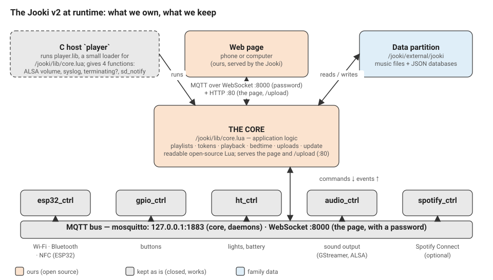

# OpenJooki: how it works

The parents' guide is the [main page](../README.md). This is the plumbing behind it:
why it cannot break a Jooki, how to do everything from a computer, how the Jooki
was taken apart, and the new core that replaces its brain.

## Why it can't break a Jooki

Every change goes through the Jooki's own A/B update system:

- it writes to the **spare** partition, never the one that is running;
- the transfer is **checked bit for bit** (sha256), and every written file is
  read back;
- switching over **arms an automatic rollback**: if the new version does not
  start, the Jooki goes back to the previous one at the next power-up.

The bootloader and the factory partition are **never** touched. Only a Jooki
**v2** (`ml-j2000`) is accepted; any other model is refused before anything is
written. Every system file OpenJooki replaces is kept once as `<file>.openjooki-orig`.

## Installing from the phone

The installer page ([github.io](https://guillain-rdcde.github.io/OpenJooki/)) sends
the install command to the Jooki, which downloads the latest release from this
repository, verifies it, writes it to the spare partition and restarts. A tiny
throwaway `ok` tab may flash up when the command is sent: the page is served over
HTTPS and the Jooki answers over plain HTTP, so the browser won't let the command
fire completely invisibly. Details: [16-phone-install.md](16-phone-install.md);
how a Jooki fetches and installs a release by itself: [15-ota-github.md](15-ota-github.md).

## Installing from a computer

With Python 3 on a computer on the same Wi-Fi:

```sh
python3 tools/openjooki/installer_web.py
```

A browser page opens: drop the firmware on it, click **Install safely**: the same
A/B install, with a progress bar ([14-cross-platform-installer.md](14-cross-platform-installer.md)).

The command-line tool does the rest over the local network, with the Python
standard library only ([tools/openjooki/README.md](../tools/openjooki/README.md)):

```sh
python3 tools/openjooki/jooki.py --host <jooki-ip> info                          # what is running
python3 tools/openjooki/jooki.py --host <jooki-ip> backup                        # full backup first
python3 tools/openjooki/jooki.py --host <jooki-ip> patch webui --dry-run         # build and check only
python3 tools/openjooki/jooki.py --host <jooki-ip> patch webui                   # page + fixes (A/B)
python3 tools/openjooki/jooki.py --host <jooki-ip> patch webui --core build/player.lib   # the 2.0 core (A/B)
python3 tools/openjooki/jooki.py --host <jooki-ip> patch switch <2|3>            # go back
```

Release images get exactly the same changes with `scripts/add-webui-to-image.py`.

A bigger SD card: [the tool's page](sdcard.html) and [how it works](../tools/sdcard/README.md); it copies the Jooki's card to a
bigger one (Windows, Mac, Linux) and grows the music partition (GPT) to the end of the card.

## The page and the fixes (1.x)

A local page (no framework, no external request) replaces the 2018 app, and the
Jooki's own program is fixed in place: token links by character, protected
"Unused tracks", no file loss on failed uploads, no crash on bad messages, safer
database writes. Then bedtime (audiobook resume, sleep timer, night mode) and
network health (uploads that survive a weak Wi-Fi, logs kept home, a `.local` name).
See [18-web-ui.md](18-web-ui.md), [19-bedtime.md](19-bedtime.md) and
[20-network-health.md](20-network-health.md).

## The Jooki, taken apart

To replace its brain, we first read all of it. The Jooki v2 is a set of small
closed programs (Wi-Fi/NFC chip, buttons, lights, sound, web server) talking over
a local MQTT bus, plus one application program that holds all the behaviour: what
a token does, how playback works, what the lights mean, when it turns itself off.



- [22-core-inventory.md](22-core-inventory.md): the original application, function
  by function, with measurements taken on a live Jooki, and what it does that a
  good program should not.
- [08-system-mqtt-map.md](08-system-mqtt-map.md): the internal bus.
- [23-nfc-tags.md](23-nfc-tags.md): what the NFC reader reports, the format of a
  Jooki token, and how OpenJooki uses any other tag.
- [24-hardware-and-lights.md](24-hardware-and-lights.md): what every light means,
  the battery (the cell, its thermal sensor, replacing it), the USB-C port and
  Muuselabs' charging notice, and a Jooki that no longer lights up.
- [09-internals-deep-dive.md](09-internals-deep-dive.md): ESP32 protocol, boot, partitions.
- [12-firmware-audit.md](12-firmware-audit.md): the security audit and its fixes.
- [06-root-access.md](06-root-access.md): getting root over SSH.
- [17-jooki-v1-uart-recovery.md](17-jooki-v1-uart-recovery.md): a Jooki v1 brought
  back through its serial console.

## OpenJooki 2.0: our own core

Our own open-source application for the Jooki, in readable Lua: one event loop,
pure handlers, all input and output behind adapters, a versioned contract with the
page (the 1.x one is kept), atomic data files shared with 1.x.

- Design: [21-architecture-2.0.md](21-architecture-2.0.md); decisions: [adr/](adr/README.md);
  the contract, generated from the code: [api-v2.md](api-v2.md); the code: [core/](../core/README.md).
- The test bench of 1.x is the oracle: its integration checks pass unchanged on
  the new core, in CI, with the core's own unit specs, lint, size and memory budgets.
- **Released as OpenJooki 2.0.0 on 27 September 2026**, after a day on a family Jooki:
  it starts faster than 1.x, lets the family choose the Jooki's network name, and gives
  the page a proper home-screen icon. A factory Jooki's data was checked to survive the
  move to 2.0 and the way back. **2.0.1** (same day) makes the update screen show plain
  steps instead of a raw download meter, and no longer reports a failed update on a
  brief network drop.

## Layout

```
core/                     OpenJooki 2.0: the new core (Lua), its specs and build
tools/openjooki/          the command-line tool, the web installer, the auditable fixes
tools/openjooki/webui/    the local web page served by the Jooki
tools/openjooki/system/   system files OpenJooki installs (originals kept)
tools/openjooki/tests/    off-device test bench (real application + browser)
tools/openjooki/device/   scripts that run on the Jooki (self-install, OTA)
tools/build/              builds the core into the Jooki's program format
tools/sdcard/             the bigger-SD-card tool: Python (Mac, Linux), the Mac app; Windows: docs/Jooki-SD-card.cmd
scripts/                  release images
docs/                     analysis, architecture, runbooks, audit (this page)
```

## Everything else in docs/

[01-notes.md](01-notes.md) (first findings), [02-community.md](02-community.md)
(what others found), [03-maintenance-plan.md](03-maintenance-plan.md),
[04-architecture.md](04-architecture.md) (hardware and data model),
[05-runbook-phase0.md](05-runbook-phase0.md), [07-jooki-v3-open-firmware.md](07-jooki-v3-open-firmware.md),
[10-patch-tool-design.md](10-patch-tool-design.md) (the A/B patch design),
[11-content-api.md](11-content-api.md), and the [changelog](../CHANGELOG.md).
